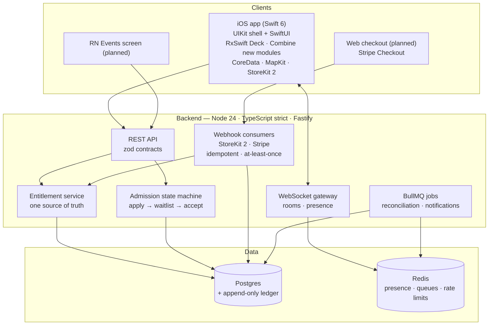

<div align="center">

# Irlo

**Swipe into real life.**

*A backend-first, open-source platform for discovering and joining nearby
in-person activities — run crews, gallery nights, pickup games.*

<!-- PLACEHOLDER: logo lands with the v0.1.0 design pass (docs/media/README.md spec) -->

[](https://github.com/sebkoo/irlo/actions/workflows/ci.yml)
[](https://codecov.io/gh/sebkoo/irlo)
[](LICENSE)
[](.mise.toml)
[](tsconfig.base.json)
[](apps/ios/project.yml)
[](apps/ios/project.yml)
[](CONTRIBUTING.md)

*The codecov % above is canary-surface coverage, not proof of a tested system:
Stage 1's `server/src` is a Fastify app factory with one `/health` endpoint,
zod-parsed env config, and structured logging
([ADR-0003](docs/adr/0003-backend-platform.md)), covered by supertest
integration tests plus unit/contract tests for the env config. Real coverage
grows endpoint-by-endpoint from here — see
[`NEXT_STEPS.md`](NEXT_STEPS.md).*

</div>

---

> **🎬 30-second demo — placeholder.** The demo GIF lands with the first
> user-facing milestone (v0.1.0). Until then, this repo's "demo" is its
> engineering: start with [the architecture](#architecture) and
> [docs/adr/](docs/adr/README.md).

## Table of contents

- [What's inside](#whats-inside)
- [Why Irlo](#why-irlo)
- [Architecture](#architecture)
- [Engineering quality](#engineering-quality)
- [AI-native workflow](#ai-native-workflow)
- [Roadmap](#roadmap)
- [Getting started](#getting-started)
- [Monetization design](#monetization-design)
- [Contributing](#contributing)
- [FAQ](#faq)
- [License](#license)

## What's inside

| Tier | What | Where | Evidence |
|---|---|---|---|
| **Platform** (Node.js/TypeScript) | Payments dual-rail (StoreKit 2 + Stripe), provider-agnostic entitlements, admission/waitlist state machine, realtime chat, Deck feed API | [`server/`](server/) · [`packages/contracts/`](packages/contracts/) | [ADR-0004](docs/adr/0004-payments-platform.md) · [ADR-0005](docs/adr/0005-member-experience-core.md) *(design docs — implementation is [planned](NEXT_STEPS.md))* |
| **Clients** | Swift 6 iOS app (UIKit shell + SwiftUI), React Native brownfield screen *(planned)* | [`apps/ios/`](apps/ios/) | [ADR-0008](docs/adr/0008-ios-demo-client.md) · canary tests (XCTest/XCUITest) wired into CI |

Today the repo is **Stage 1 in progress**: Stage 0's verified name,
canary-tested monorepo, CI, AI-native engineering harness, and full design
record, plus a live Fastify `/health` endpoint, typed env config, and
structured logging as the server foundation comes online. Every feature above
is planned in [`NEXT_STEPS.md`](NEXT_STEPS.md) —
nothing is quietly half-built.

## Why Irlo

Loneliness is now a measured global health issue, not a mood. The WHO Commission
on Social Connection reports that **1 in 6 people worldwide is affected by
loneliness**, linked to an estimated 100 deaths every hour ([WHO, June
2025](https://www.who.int/news/item/30-06-2025-social-connection-linked-to-improved-heath-and-reduced-risk-of-early-death)).
In the US, **21% of adults report feeling lonely** — rising to 34% among young
adults — and 73% of respondents point at technology as a cause ([Harvard Making
Caring Common, May 2024](https://mcc.gse.harvard.edu/reports/loneliness-in-america-2024)).
Full citation records: [`docs/research/citations.md`](docs/research/citations.md).

The gap isn't matching people online — apps do that relentlessly. The gap is
**showing up offline**: the run crew that actually meets on Saturday, the
gallery night that actually happens. Irlo's mechanics point every interaction at
a real place and time: swipe into an activity, clear a crew's waitlist, chat
with the people who'll be there.

Irlo exists to help people spend more of their lives in quality, in-person
interaction — and, as an open-source project, to show exactly how the systems
behind that promise are engineered.

## Architecture



*Everything outside `apps/ios`'s scaffold and the canary-tested workspaces is
design-stage — see the ADR trail.*

| Read the code / design | Entry point |
|---|---|
| ADR index (the architecture tour) | [`docs/adr/README.md`](docs/adr/README.md) |
| Contracts-first API shapes | [`packages/contracts/src/`](packages/contracts/src/) |
| Payments platform design | [ADR-0004](docs/adr/0004-payments-platform.md) |
| Admission/waitlist design | [ADR-0005](docs/adr/0005-member-experience-core.md) |
| User stories → tests → evidence | [`docs/user-stories.md`](docs/user-stories.md) |

## Engineering quality

**Why this looks like production, not a demo:**

- **TDD triplets.** Every feature: `test(scope): failing spec` →
  `feat(scope): make it pass` → `refactor(scope): …`. Real example already in
  history: commit `test(ios): add unit and UI canary tests…` quotes its own red
  run (`type 'RootView' has no member 'accessibilityID'`) before the green.
- **Coverage gates in CI:** `server/src` ≥ 90%; payments + admission state
  machines require 100% branch; iOS kit ≥ 85% as it grows.
- **Contract-first APIs:** zod schemas in
  [`packages/contracts`](packages/contracts/) are the single source of truth —
  server derives types from them and validates every boundary at runtime.
- **CI matrix:** Ubuntu (typecheck · lint · format · Vitest+coverage) and
  macOS 26 (XcodeGen → XCTest/XCUITest on a dynamically-resolved simulator),
  Codecov flags `server`/`ios`.
- **Observability as a deliverable:** pino structured logs live on the
  `/health` endpoint onward; OpenTelemetry traces next
  ([ADR-0003](docs/adr/0003-backend-platform.md), planned).
- **Atomic, explained commits:** Conventional Commits 1.0; bodies explain *why*;
  history reads as a plan, not an accident — inspect `git log`.

## AI-native workflow

Built in public with Claude Code, and the workflow is itself versioned
engineering: a <300-line [`CLAUDE.md`](CLAUDE.md), eight encoded slash-command
workflows, format/lint/test hooks, a code-reviewer subagent, and a
release-blocking [eval checklist](docs/ai/evals.md) for the harness itself.
Models and efforts used are disclosed per work type in
[`docs/ai/methodology.md`](docs/ai/methodology.md) — transparency is part of
the credibility.

## Roadmap

| Horizon | Work |
|---|---|
| **Now** (done) | Stage 0: verified name · toolchain · canary-tested monorepo · CI · AI harness · full design record (ADR 0001–0008). Stage 1 underway: Fastify `/health` triplet, zod-parsed env config, pino structured logging live |
| **Next** | Server foundation online: OpenTelemetry bootstrap, Docker dev env, Drizzle + Testcontainers → then entitlements & admission (US-01/02) |
| **Later** | Stripe rail → App Store rail → reconciliation → Deck feed → chat gateway → iOS flows → web checkout → RN screen → pgvector ranking |

Full sequence with commit-level granularity: [`NEXT_STEPS.md`](NEXT_STEPS.md).

## Getting started

```bash
git clone https://github.com/sebkoo/irlo.git && cd irlo
make bootstrap
make test
```

Then: `pnpm --filter @irlo/server test:watch` for the server loop, or
`open apps/ios/Irlo.xcodeproj` (generated by bootstrap) for the iOS client.
Details: [`CONTRIBUTING.md`](CONTRIBUTING.md).

## Monetization design

Consumable boosts (`spark.*`, `waitlist.skip`, `undo.pack10`) and an **Irlo+**
subscription, sold on two rails — StoreKit 2 in-app and Stripe on the web —
feeding one provider-agnostic entitlement service with an append-only ledger and
nightly reconciliation. It's a payments-engineering showcase first; the design
doc is [`docs/monetization.md`](docs/monetization.md), the architecture is
[ADR-0004](docs/adr/0004-payments-platform.md).

## Contributing

PRs welcome — start with [`CONTRIBUTING.md`](CONTRIBUTING.md) and the
[good-first-issue template](.github/ISSUE_TEMPLATE/good-first-issue.yml).
Every user-story PR ships tests and evidence
([`docs/user-stories.md`](docs/user-stories.md)). We follow the
[Contributor Covenant](CODE_OF_CONDUCT.md); security reports:
[`SECURITY.md`](SECURITY.md).

## FAQ

<details>
<summary><b>Is Irlo a dating app?</b></summary>

No. Irlo is activity-first: you join a run crew or a gallery night, not a
person's inbox. The admission/waitlist mechanics exist to keep small groups
good, not to gate romance.
</details>

<details>
<summary><b>Why build the payments stack instead of using RevenueCat?</b></summary>

Because demonstrating the machinery is this repo's purpose. RevenueCat is the
pragmatic choice for many teams — the honest build-vs-buy analysis is in
[`docs/monetization.md`](docs/monetization.md).
</details>

<details>
<summary><b>Can I run the backend without the iOS toolchain?</b></summary>

Yes. `make test-server` needs only mise (Node/pnpm). Xcode is required only for
`make test-ios` and the app itself.
</details>

<details>
<summary><b>What does "Irlo" mean?</b></summary>

A coined word: IRL + o, pronounced /ˈɜːr.loʊ/. In Korean it puns on 일로 (와) —
"come over here." Name verification evidence:
[`docs/naming/verification.md`](docs/naming/verification.md).
</details>

<details>
<summary><b>Is this affiliated with any existing membership app?</b></summary>

No — see the disclaimer below. The Member Experience domain (applications,
waitlists, entitlements) is an industry-standard pattern studied on public
information.
</details>

## Star history

<!-- PLACEHOLDER: Star History chart (star-history.com) embeds here once the repo is public and has meaningful history. -->

## License

[MIT](LICENSE) © 2026 Ben Koo

---

> **Non-affiliation disclaimer:** Irlo is an independent, open-source portfolio
> project. It is not affiliated with, endorsed by, or connected to Raya or any
> other membership platform. Competitive/product research references appear only
> in [`docs/interview/`](docs/interview/) as personal study notes.
