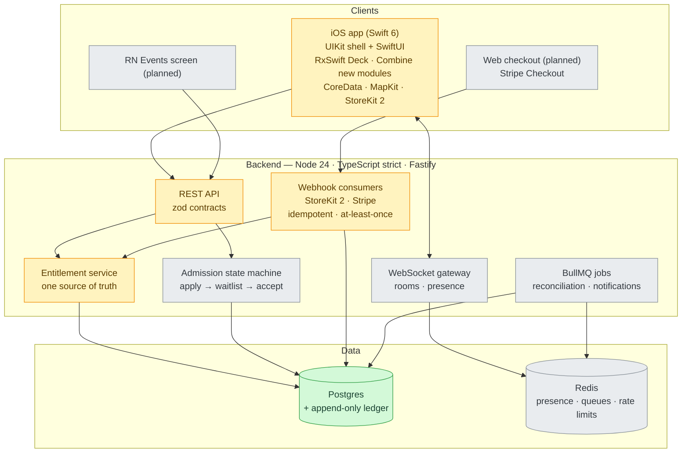

<div align="center">

# Irlo

**Swipe into real life.**

*A backend-first, open-source platform for discovering and joining nearby
in-person activities — run crews, gallery nights, pickup games.*

[](https://github.com/sebkoo/irlo/actions/workflows/ci.yml)
[](https://codecov.io/gh/sebkoo/irlo)
[](LICENSE)
[](.mise.toml)
[](tsconfig.base.json)
[](apps/ios/project.yml)
[](apps/ios/project.yml)
[](CONTRIBUTING.md)

*Honest badge scope: coverage is CI-gated (`server/src` ≥ 90%; payments +
admission state machines 100% branch) and today measures the server foundation
plus the ADR-0009 payments domain — a real number, not proof the whole design
is built. What runs vs. what's design-stage is labeled in
[Start here](#start-here).*

</div>

---

## Table of contents

- [Start here](#start-here)
- [What's inside](#whats-inside)
- [Why Irlo](#why-irlo)
- [Architecture](#architecture)
- [Engineering quality](#engineering-quality)
- [How this is built](#how-this-is-built)
- [Roadmap](#roadmap)
- [Getting started](#getting-started)
- [Monetization design](#monetization-design)
- [Contributing](#contributing)
- [FAQ](#faq)
- [License](#license)

## Start here

**Implemented and tested on `main` today** — the entitlement domain
([ADR-0009](docs/adr/0009-entitlement-domain-model.md)) and the Stripe side of
the payments rail, landed as reviewed TDD triplets:

- **Stripe webhook endpoint** — signature verification, event normalization,
  five idempotent event consumers (purchases, subscription economic events,
  multi-fact context envelopes, consumable refunds, member↔rail-identity
  linkage), and the `POST /webhooks/stripe` route dispatching purchase,
  context, subscription-economic, and linkage events (consumable-refund is
  wired for the Apple rail instead) in
  [`server/src/payments/`](server/src/payments/) and
  [`server/src/routes/`](server/src/routes/) — Testcontainers-verified against
  the [route spec's fixture
  matrix](server/test/routes/stripe-webhook.route.testcontainers.test.ts)
  (golden path, redelivery dedup, unresolvable routing, missing/bad/reparsed
  signatures, an unsupported event type, a genuine infra-fault-then-retry, and
  the flagship out-of-order pair — an unlinked purchase 5xxes, a
  `checkout.session.completed` backstop links it, the same purchase envelope
  redelivered then succeeds). A purchase whose customer has no linked member
  still 5xxes as `unlinked_customer` — real production purchases stay in that
  state until the checkout-session endpoint ([ADR-0011](docs/adr/0011-member-rail-identity-linkage.md)
  slice D, not yet built) starts creating links
- **Entitlement persistence** — append-only ledger, the seven-table ADR-0009
  schema as Testcontainers-verified Drizzle migrations, typed repositories in
  [`server/src/db/`](server/src/db/)
- **Subscription state machine** — a pure transition function in
  [`server/src/domain/`](server/src/domain/)
- **Server foundation** — Fastify app factory, `/health`, zod-parsed env
  config, pino structured logging, dockerized dev env

Three links that show *how* it's built, not just what:

1. **A red→green pair:**
   [`test(payments): failing spec for the context-event executor`](https://github.com/sebkoo/irlo/commit/43914db7249fce118813822f18b337c27a628764)
   → [`feat(payments): implement the context-event executor`](https://github.com/sebkoo/irlo/commit/8d6adc7f94d891edf9c1258ab6b0d6420a03223f)
   — the failing spec lands first, every time; the history reads like this
   throughout.
2. **The decision record behind it:**
   [ADR-0009 — entitlement domain model](docs/adr/0009-entitlement-domain-model.md)
   — states, guards, idempotency, and reconciliation pinned down *before* the
   code.
3. **The review loop leaving fingerprints:**
   [`fix(payments): rename consumeContextEvent, wire renewal_extended's periodEnd (review SHOULD-FIX x2)`](https://github.com/sebkoo/irlo/commit/68890d18f8ee1becb3d034f3edc4fa06aed88110)
   — code-reviewer findings land as their own commits, not silent amends.

## What's inside

| Status | Tier | What | Where | Evidence |
|---|---|---|---|---|
| 🚧 in progress | **Platform** (Node.js/TypeScript) | Payments dual-rail (StoreKit 2 + Stripe), provider-agnostic entitlements, admission/waitlist state machine, realtime chat, Deck feed API | [`server/`](server/) · [`packages/contracts/`](packages/contracts/) | [ADR-0004](docs/adr/0004-payments-platform.md) · [ADR-0005](docs/adr/0005-member-experience-core.md) · [ADR-0009](docs/adr/0009-entitlement-domain-model.md) *(entitlement core + Stripe consumers implemented — [Start here](#start-here); StoreKit rail, admission, chat, Deck are [planned](NEXT_STEPS.md))* |
| 🚧 in progress | **Clients** | Swift 6 iOS app (UIKit shell + SwiftUI), React Native brownfield screen *(planned)* | [`apps/ios/`](apps/ios/) | [ADR-0008](docs/adr/0008-ios-demo-client.md) · canary tests (XCTest/XCUITest) wired into CI |

Today the repo carries Stage 0's verified name, canary-tested monorepo, CI,
AI-native engineering harness, and full design record; a live server
foundation; and the ADR-0009 entitlement domain + Stripe event consumers,
landed as reviewed TDD triplets ([Start here](#start-here)). Everything beyond
that is planned in [`NEXT_STEPS.md`](NEXT_STEPS.md) — nothing is quietly
half-built.

## Why Irlo

Loneliness is now a measured global health issue, not a mood. The WHO Commission
on Social Connection reports that **1 in 6 people worldwide is affected by
loneliness**, linked to an estimated 100 deaths every hour ([WHO, June
2025](https://www.who.int/news/item/30-06-2025-social-connection-linked-to-improved-heath-and-reduced-risk-of-early-death)).
In the US, **21% of adults report feeling lonely** — rising to 34% among young
adults — and 73% of respondents point at technology as a cause ([Harvard Making
Caring Common, May 2024](https://mcc.gse.harvard.edu/reports/loneliness-in-america-2024)).
Full citation records: [`docs/research/citations.md`](docs/research/citations.md).

The gap isn't matching people online — apps do that relentlessly. The gap is
**showing up offline**: the run crew that actually meets on Saturday, the
gallery night that actually happens. Irlo's mechanics point every interaction at
a real place and time: swipe into an activity, clear a crew's waitlist, chat
with the people who'll be there.

Irlo exists to help people spend more of their lives in quality, in-person
interaction — and, as an open-source project, to show exactly how the systems
behind that promise are engineered.

## Architecture

**Legend:** ✅ shipped & tested on `main` · 🚧 in progress · 📋 designed ([ADR-linked](docs/adr/README.md))



*The diagram is the full design. What runs today vs. what's design-stage is
labeled in [Start here](#start-here); the trail from decision to code is
[docs/adr/](docs/adr/README.md).*

| Read the code / design | Entry point |
|---|---|
| ADR index (the architecture tour) | [`docs/adr/README.md`](docs/adr/README.md) |
| Contracts-first API shapes | [`packages/contracts/src/`](packages/contracts/src/) |
| Payments platform design | [ADR-0004](docs/adr/0004-payments-platform.md) |
| Entitlement domain model (states · ledger · idempotency) | [ADR-0009](docs/adr/0009-entitlement-domain-model.md) |
| Admission/waitlist design | [ADR-0005](docs/adr/0005-member-experience-core.md) |
| User stories → tests → evidence | [`docs/user-stories.md`](docs/user-stories.md) |

## Engineering quality

**Why this looks like production, not a demo:**

- **TDD triplets.** Every feature: `test(scope): failing spec` →
  `feat(scope): make it pass` → `refactor(scope): …`. The payments domain
  landed this way commit by commit ([Start here](#start-here)); even the first
  iOS canary quotes its own red run (`type 'RootView' has no member
  'accessibilityID'`) before the green.
- **Coverage gates in CI:** `server/src` ≥ 90%; payments + admission state
  machines require 100% branch; iOS kit ≥ 85% as it grows.
- **Contract-first APIs:** zod schemas in
  [`packages/contracts`](packages/contracts/) are the single source of truth —
  server derives types from them and validates every boundary at runtime.
- **CI matrix:** Ubuntu (typecheck · lint · format · Vitest+coverage) and
  macOS 26 (XcodeGen → XCTest/XCUITest on a dynamically-resolved simulator),
  Codecov flags `server`/`ios`.
- **Observability as a deliverable:** pino structured logs live on the
  `/health` endpoint onward; OpenTelemetry traces land alongside them —
  `buildApp`'s optional `tracing` seam stamps `traceId`/`spanId` on each
  request's completed log line, asserted through an in-memory span exporter
  ([ADR-0003](docs/adr/0003-backend-platform.md)).
- **Atomic, explained commits:** Conventional Commits 1.0; bodies explain *why*;
  history reads as a plan, not an accident — inspect `git log`.

## How this is built

AI-assisted, in public, with Claude Code — and every line is reviewed before
it lands: the AI is the typist, the engineer stays accountable. The workflow
itself is versioned, auditable engineering — prompt, context, harness, and
loop engineering: a <300-line
[`CLAUDE.md`](CLAUDE.md) constitution, eight encoded slash-command workflows,
`make test-ci` gates (typecheck · lint · format · coverage · mermaid render)
enforced before every push — plus convenience-only, fail-open session hooks
that format-on-edit but never block — a code-reviewer subagent whose findings
land as their own commits, and a release-blocking [eval
checklist](docs/ai/evals.md) for the harness itself.
[`docs/ai/methodology.md`](docs/ai/methodology.md) discloses models and
effort per work type — including eight recorded self-enforcement cases where
the harness (or the human) caught the tool cutting a corner. That
governance isn't an apology; it's one of the things this repo is built to
demonstrate.

## Roadmap

| Horizon | Work |
|---|---|
| **Now** | Stage 0 complete. Stage 1 server foundation live. Stage 2 entitlements and Stage 3 Stripe rail landed through ADR-0011 slice C — see the generated status below ([Start here](#start-here)) |
| **Next** | ADR-0011 slice D (checkout-session endpoint; real purchases 5xx until it lands) · admission & waitlist (US-01/02) — order of record in [`NEXT_STEPS.md`](NEXT_STEPS.md) |
| **Later** | App Store rail → reconciliation → Deck feed → chat gateway → iOS flows → web checkout → RN screen → pgvector ranking. The 30-second demo GIF ships with the first user-facing milestone (v0.1.0) |

Regenerated from [`NEXT_STEPS.md`](NEXT_STEPS.md) every commit by
`make docs-progress`; a stale block fails CI (`make lint` / `make test-ci`
diff the regenerated output against this file). Not "real-time" — a
committed file can't be live — but it can't silently drift out of date
either. Legend: ✅ shipped & tested on `main` · 🚧 in progress · 📋 planned.

<!-- progress:begin -->

### Stage 0 — Naming, toolchain, CI, AI harness (done)

- ✅ **C01–C12** — verified name, toolchain, canary-tested monorepo, CI, AI harness, docs

### Stage 1 — Server foundation online (≈C13–C22)

- ✅ **C13–C15** — `/health` endpoint triplet on Fastify app factory
- ✅ **C16** — zod-parsed env config (12-factor)
- ✅ **C17** — pino structured logging
- ✅ **C18** — OpenTelemetry bootstrap
- ✅ **C19** — docker-compose dev env (Postgres + Redis)
- ✅ **C20** — DATABASE_URL env contract + Drizzle client factory
- ✅ **C21–C22** — Drizzle schema/migrations (Testcontainers-verified) + members repository triplet

### Stage 2 — Entitlements & admission (≈C23–C36) — US-01, US-02

- ✅ **C23** — <details><summary>entitlement service logic — ledger repository + inbox repository — over the ADR-0009 tables C21…</summary> entitlement service logic — ledger repository + inbox repository — over the ADR-0009 tables C21 already created (schema/tables moved to Stage 1 as ADR-0009's persistence substrate; this triplet is service logic, not schema, per the 2026-07-11 C21 scope note above).</details>
- ✅ **C24–C27** — <details><summary>subscription state-machine reducer: C24 pure state graph (`transition`), C25 idempotency layer 3…</summary> subscription state-machine reducer: C24 pure state graph (`transition`), C25 idempotency layer 3 (`applyEvent`'s monotonic `highWater` guard, I5a stale-but-economic events), C26 context-only events (`autorenew_set`, `plan_changed`, `renewal_extended`), C27 generation-spawning (`applyPurchase` — `[*] --> trial|active` entry transitions, RESUBSCRIBE-on-terminal spawning generation+1 per I6). This is the pure reducer only — no executor/persistence wiring yet; that lands as part of Stage 3's "subscription state machine wiring" (below), the reducer's first real caller, rather than as a standalone Stage 2 step.</details>
- 📋 **C28–C29** — <details><summary>capability check `can(member, capability)` + gating middleware *(renumbered from C26–C27 — the…</summary> capability check `can(member, capability)` + gating middleware *(renumbered from C26–C27 — the reducer completion above claimed those numbers first; C-numbers are planning handles per this doc's own header, not promises of exact count, so this is a relabel, not a scope change)*</details>
- 📋 **C30–C33** — admission state machine (pure core, 100% branch) + persistence
- 📋 **C34–C35** — waitlist lanes + `waitlist.skip` consumption (idempotent)
- 📋 **C36** — admission audit log + evidence (sequence diagram, hurl transcripts)

### Stage 3 — Stripe rail (≈C37–C44) — US-09 (server half), US-10

- ✅ **Slice A** — `rail_identities` migration + repository triplet (Testcontainers) — the eighth ADR-0009-family table; a new Stage 3 migration, not a C21 reopen.
- ✅ **Slice B** — linkage consumer (`checkout.session.completed` → link upsert + inbox row, per ADR-0011 §3b's outcome table) + `linkage_event` normalizer kind + route dispatch.
- ✅ **Slice C** — <details><summary>purchase-branch retirement: `resolveMemberByRailIdentity` + `consumePurchaseEvent` wiring; the stub…</summary> purchase-branch retirement: `resolveMemberByRailIdentity` + `consumePurchaseEvent` wiring; the stub test mutates into the `unlinked_customer` test; ADR-0011 §3g lists the full test-flip set (golden path, out-of-order pair, conflict).</details>
- 📋 **Slice D** — checkout-session endpoint — the already-planned Stage 3 bullet, now specified: create-or-reuse the Customer and commit the link before creating the session.

### Stage 4 — App Store rail (≈C43–C49) — US-07, US-08 (server half)

_No slice-level items yet — see the stage heading in NEXT_STEPS.md._

### Stage 5 — Reconciliation (≈C50–C52)

_No slice-level items yet — see the stage heading in NEXT_STEPS.md._

### Stage 6 — Deck feed API (≈C53–C58) — US-03

_No slice-level items yet — see the stage heading in NEXT_STEPS.md._

### Stage 7 — Chat gateway (≈C59–C66) — US-06, US-13

_No slice-level items yet — see the stage heading in NEXT_STEPS.md._

### Stage 8 — iOS client flows (≈C67–C74) — US-03..05, US-07/08 (client), US-12

_No slice-level items yet — see the stage heading in NEXT_STEPS.md._

### Stage 9 — Web checkout, RN screen (≈C75–C80)

_No slice-level items yet — see the stage heading in NEXT_STEPS.md._

### Stage AI — retrieval slice (planned, not started)

_No slice-level items yet — see the stage heading in NEXT_STEPS.md._

<!-- progress:end -->

Full sequence with commit-level granularity: [`NEXT_STEPS.md`](NEXT_STEPS.md).

## Getting started

```bash
git clone https://github.com/sebkoo/irlo.git && cd irlo
make bootstrap
make test
```

Then: `pnpm --filter @irlo/server test:watch` for the server loop, or
`open apps/ios/Irlo.xcodeproj` (generated by bootstrap) for the iOS client.
Details: [`CONTRIBUTING.md`](CONTRIBUTING.md).

## Monetization design

Consumable boosts (`spark.*`, `waitlist.skip`, `undo.pack10`) and an **Irlo+**
subscription, sold on two rails — StoreKit 2 in-app and Stripe on the web —
feeding one provider-agnostic entitlement service with an append-only ledger and
nightly reconciliation. It's a payments-engineering showcase first; the design
doc is [`docs/monetization.md`](docs/monetization.md), the architecture is
[ADR-0004](docs/adr/0004-payments-platform.md).

## Contributing

PRs welcome — start with [`CONTRIBUTING.md`](CONTRIBUTING.md) and the
[good-first-issue template](.github/ISSUE_TEMPLATE/good-first-issue.yml).
Every user-story PR ships tests and evidence
([`docs/user-stories.md`](docs/user-stories.md)). We follow the
[Contributor Covenant](CODE_OF_CONDUCT.md); security reports:
[`SECURITY.md`](SECURITY.md).

## FAQ

<details>
<summary><b>Is Irlo a dating app?</b></summary>

No. Irlo is activity-first: you join a run crew or a gallery night, not a
person's inbox. The admission/waitlist mechanics exist to keep small groups
good, not to gate romance.
</details>

<details>
<summary><b>Why build the payments stack instead of using RevenueCat?</b></summary>

Because demonstrating the machinery is this repo's purpose. RevenueCat is the
pragmatic choice for many teams — the honest build-vs-buy analysis is in
[`docs/monetization.md`](docs/monetization.md).
</details>

<details>
<summary><b>Can I run the backend without the iOS toolchain?</b></summary>

Yes. `make test-server` needs only mise (Node/pnpm). Xcode is required only for
`make test-ios` and the app itself.
</details>

<details>
<summary><b>What does "Irlo" mean?</b></summary>

A coined word: IRL + o, pronounced /ˈɜːr.loʊ/. In Korean it puns on 일로 (와) —
"come over here." Name verification evidence:
[`docs/naming/verification.md`](docs/naming/verification.md).
</details>

<details>
<summary><b>Is this affiliated with any existing membership app?</b></summary>

No — see the disclaimer below. The Member Experience domain (applications,
waitlists, entitlements) is an industry-standard pattern studied on public
information.
</details>

## License

[MIT](LICENSE) © 2026 Ben Koo

---

> **Non-affiliation disclaimer:** Irlo is an independent, open-source portfolio
> project. It is not affiliated with, endorsed by, or connected to Raya or any
> other membership platform. Competitive/product research references appear only
> in [`docs/interview/`](docs/interview/) as personal study notes.
