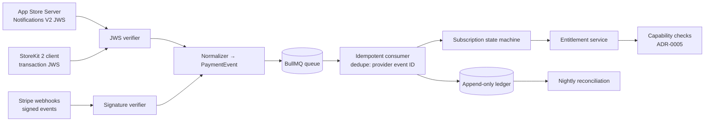
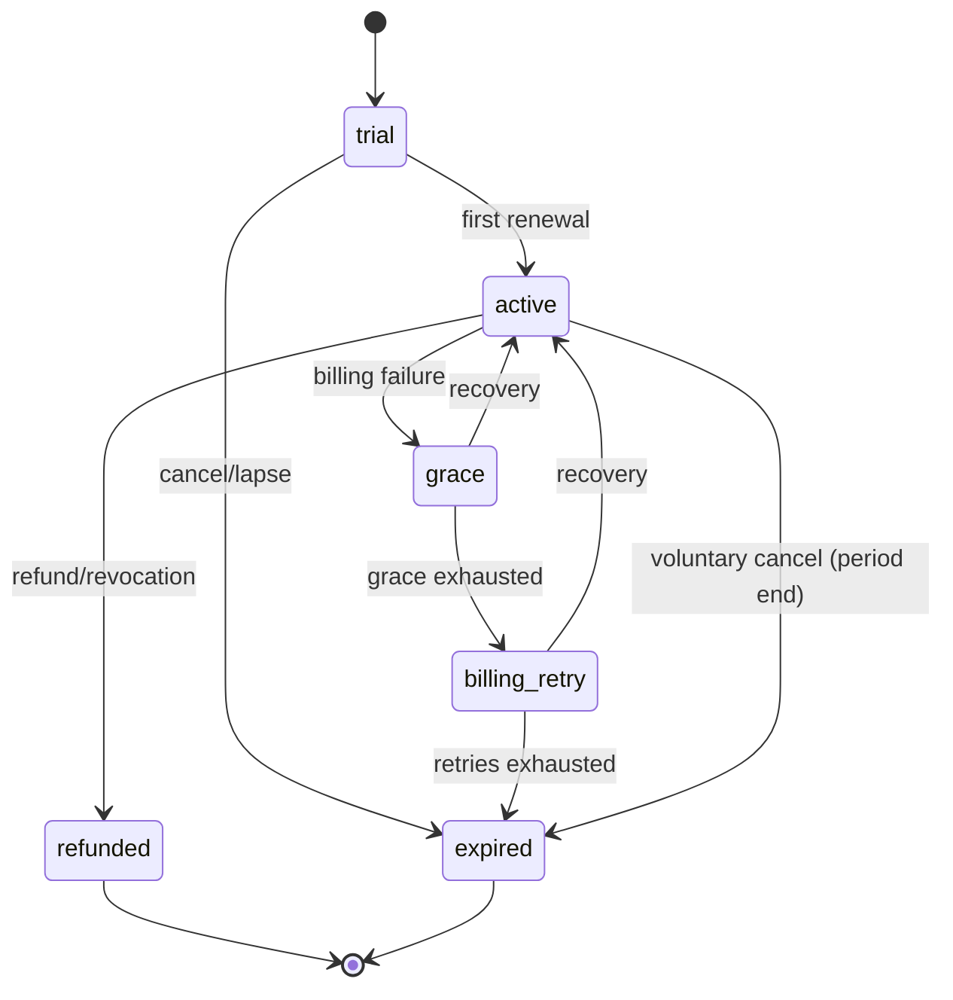

# 0004 — Payments platform: dual rail, one entitlement truth

- Status: accepted
- Date: 2026-07-10
- Deciders: Ben Koo

## Context and problem statement

Irlo sells digital goods on two rails: **StoreKit 2** in-app (subscriptions +
consumables) and **Stripe** on the web (same subscription sold outside the app).
Money events arrive asynchronously, out of order, duplicated, and from providers
with different vocabularies. The system must answer one question correctly at all
times: *what is this member entitled to right now?* — while remaining auditable
to the cent. This is the interview centerpiece (JD rows 4 and 5) and the domain
core of Member Experience ([ADR-0005](0005-member-experience-core.md)).

## Decision drivers

- **D1 Correctness under retries:** providers deliver at-least-once; effects must be exactly-once.
- **D2 One source of truth:** clients never compute entitlements from receipts; the server does.
- **D3 Auditability:** every balance is derivable from an immutable history.
- **D4 Testability without live money:** the whole flow provable in CI.
- **D5 Compliance:** App Review 3.1.1 and platform rules respected by construction.

## Considered options

1. **Provider-agnostic entitlement service + append-only ledger** (build)
2. RevenueCat (buy: entitlements-as-a-service across both rails)
3. Per-rail logic in each client + server spot-checks (status quo of many apps)

## Decision outcome

**Option 1 — build the entitlement service**, with this pipeline (all Stage 1+,
planned):

- **Normalization:** both rails reduce to one `PaymentEvent` contract
  (`@irlo/contracts`), so downstream code has no provider branches.
- **Idempotency:** consumer dedupes on `(provider, event_id)` with a processed-
  events table; handlers are pure functions of (event, current state) so replays
  are no-ops (D1).
- **Append-only ledger:** every grant/consumption/refund is an immutable ledger
  row; balances are sums, never mutated columns; corrections are compensating
  entries (D3). Product IDs: `spark.single`, `spark.pack5`, `undo.pack10`,
  `waitlist.skip`, `irlo.plus.monthly`, `irlo.plus.yearly`.
- **Subscription state machine** (100% branch coverage gate):

- **Entitlement service:** the only reader clients trust (D2); grants keyed to
  member, not device; web purchase unlocks iOS within seconds (US-09).
- **Reconciliation:** nightly job replays provider truth (App Store Server API
  v2 subscription statuses; Stripe subscription objects) against local state;
  drift alerts, never silent fixes (D3).
- **Test strategy (D4):** Stripe signed fixture events + test clocks for renewal/
  dunning time-travel; App Store Server Notifications V2 JWS fixtures with a test
  signing key; StoreKitTest local `.storekit` config on the client; Testcontainers-
  Postgres for ledger invariants (e.g. *balance never negative*, *replay = no-op*).

### Positive consequences

- Exactly-once *effects* on an at-least-once world, provable in tests.
- Full audit trail; refund/chargeback handling is data, not archaeology.
- The JD's two payments rows are evidenced by real, inspectable machinery.

### Negative consequences

- We own the hardest bugs (clock skew, provider retries, partial outages).
- Meaningful schema surface before the first feature ships.
- RevenueCat would reach production faster — honesty about that below.

## Pros and cons of the options

| Driver | 1. Build entitlement service | 2. RevenueCat | 3. Per-rail client logic |
|---|---|---|---|
| D1 Exactly-once effects | ✅ owned, tested | ✅ outsourced | ❌ device-local races |
| D2 One truth | ✅ by construction | ✅ theirs, not yours | ❌ N truths |
| D3 Auditability | ✅ ledger | ⚠️ their dashboard | ❌ none |
| D4 CI-testable | ✅ fixtures/clocks | ⚠️ mock their SDK | ⚠️ StoreKitTest only |
| D5 Compliance | ✅ explicit | ✅ | ⚠️ easy to violate |
| Portfolio value | ✅ the whole point | ❌ hides the domain | ❌ anti-pattern |

RevenueCat is the *pragmatic production choice* for a small team and remains a
documented build-vs-buy ADR stub in `NEXT_STEPS.md`; it loses here because the
repo's purpose is to demonstrate the machinery it would hide.

## App Review 3.1.1 note (D5)

Digital goods purchased **in-app** use IAP exclusively. The Stripe rail sells the
same entitlement **on the web**, independently discovered — no in-app steering to
external purchase in violation of current guidelines. U.S. anti-steering rules
continue to evolve (external purchase links); the design treats any future
steering allowance as additive (a link, a flag) — the entitlement layer already
doesn't care which rail granted the subscription. Restore purchases and refund
flows are first-class user paths, not afterthoughts.

## Links

- [ADR-0003](0003-backend-platform.md) — queue/DB substrate
- [ADR-0005](0005-member-experience-core.md) — capability gating consuming entitlements
- `docs/monetization.md` — catalog and pricing rationale
- User stories US-07 … US-10 — `docs/user-stories.md`

## Future trends & implications

Apple's server APIs keep moving from receipts toward signed JWS state
(Transaction/RenewalInfo) — our verify-then-normalize edge absorbs those changes
without touching domain code. Stripe continues to push Billing toward usage-based
and hybrid pricing; the append-only ledger already models consumption, so adding
metered entitlements is a consumer, not a redesign. Regulatory pressure (EU DMA,
US anti-steering) will keep expanding out-of-app purchasing — dual-rail,
provider-agnostic entitlements is the architecture that benefits from that trend
rather than being disrupted by it. Expect "entitlement service" to become as
standard a box in consumer-app diagrams as "auth service" is today.
