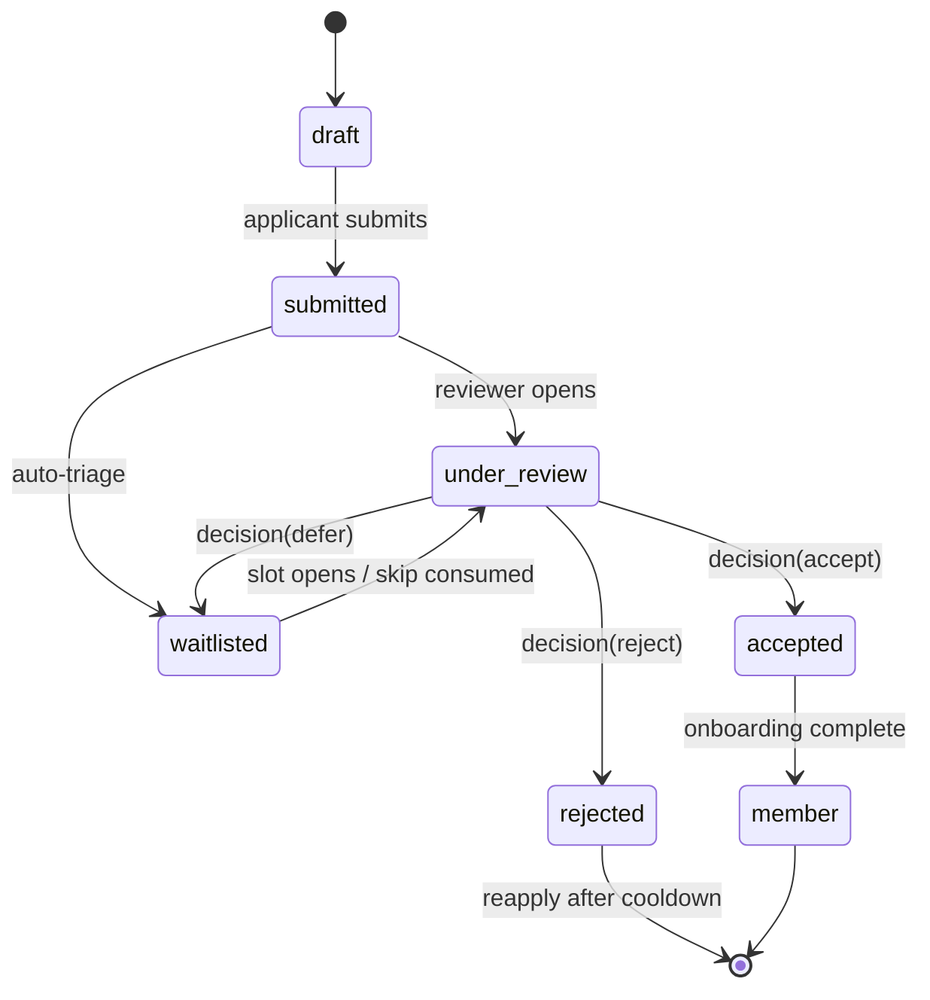

# 0005 — Member Experience core: admission, entitlement gating, audit

- Status: accepted
- Date: 2026-07-10
- Deciders: Ben Koo

## Context and problem statement

Irlo's curated crews admit members through an **application → waitlist →
acceptance** funnel — the signature mechanic of curated-membership products,
generalized. The domain must handle: applications with review, a fair and
abuse-resistant waitlist, capability differences between guests/applicants/
members/subscribers, and an audit trail for every decision. It sits directly on
the entitlement service ([ADR-0004](0004-payments-platform.md)): what you *can
do* is a function of who admitted you and what you're entitled to.

## Decision drivers

- **D1 Legibility:** admission states and transitions readable by a reviewer in one diagram; no implicit states in flag combinations.
- **D2 Fairness & throughput:** predictable queue behavior, measurable wait times, priority that is explicit and paid-for (`waitlist.skip`), never arbitrary.
- **D3 Abuse resistance:** reapplication churn, multi-accounting, and review-queue flooding must have designed answers.
- **D4 Auditability:** every decision has an actor, timestamp, and reason.
- **D5 Testability:** the state machine is a pure core with 100% branch coverage.

## Considered options

1. **Hand-rolled typed state machine** (discriminated unions + pure transition function)
2. XState (statechart library)
3. Status enum on a row + ad-hoc guards in handlers

## Decision outcome

**Option 1 — hand-rolled typed state machine**, pure and framework-free, with
Drizzle persistence and an append-only decision log.

### Admission state machine (per application)

- Transitions are a **pure function** `(state, event, context) → state | error`;
  invalid transitions are type errors where possible, runtime errors always (D1, D5).
- **Waitlist ordering:** FIFO within priority lane; the paid `waitlist.skip`
  consumable moves an application one lane up, consuming an entitlement ledger
  credit idempotently (same dedupe discipline as ADR-0004). Position and lane are
  queryable — fairness is explainable to the user (D2).
- **Fairness metrics** (Stage 1+): time-in-queue distribution per lane, decision
  SLA, acceptance-rate consistency across reviewer sessions; reported in
  `docs/product/metrics-and-experiments.md` events.
- **Abuse resistance (D3):** reapplication cooldown after rejection; rate limits
  per identity/device/IP (Redis, ADR-0003); duplicate-application detection;
  review-queue circuit breaker (auto-waitlist when queue depth exceeds SLA).
- **Capability gating:** capabilities (join crew chat, see full Deck, host
  activities, boost visibility) resolve from `(admission state, entitlements)`
  through one `can(member, capability)` check — never scattered role checks (D1).
- **Audit trail (D4):** append-only `admission_events` log — actor (member,
  reviewer, or system), event, reason code, timestamp. Decisions are derived
  state; the log is the truth, mirroring the payments ledger philosophy.

### Positive consequences

- The funnel is explainable end-to-end: a reviewer can trace any member's status
  to specific logged events.
- Pure-core design makes the 100% branch coverage gate cheap to hold.
- Paid queue-skip is principled: explicit lane, ledger-backed, reversible.

### Negative consequences

- More upfront modeling than a status column; migrations touch a state machine.
- Fairness instrumentation is real work before it pays off in the UI.

## Pros and cons of the options

| Driver | 1. Typed hand-rolled | 2. XState | 3. Enum + guards |
|---|---|---|---|
| D1 Legibility | ✅ one file, one diagram | ✅ statechart | ❌ emergent behavior |
| D5 Testability | ✅ pure function | ⚠️ library harness | ❌ handler-coupled |
| Dependency cost | ✅ zero | ⚠️ meaningful API surface | ✅ zero |
| Persistence fit | ✅ we own serialization | ⚠️ actor model vs rows | ✅ trivial |
| Interview value | ✅ shows the modeling | ⚠️ shows the library | ❌ the anti-pattern |

XState is excellent for UI orchestration; for a persisted, audited server domain
the actor abstraction adds ceremony without covering persistence/audit anyway.

## Links

- [ADR-0004](0004-payments-platform.md) — entitlements consumed by capability gating
- [ADR-0006](0006-realtime-messaging.md) — chat access is a gated capability
- User stories US-01, US-02, US-04 (undo), US-13 — `docs/user-stories.md`

## Future trends & implications

Curated/verified membership is spreading beyond social apps (communities,
marketplaces, even developer programs), and regulators increasingly ask platforms
to *explain* algorithmic queueing and rejection — an auditable, lane-explicit
admission system is ahead of that curve. LLM-assisted application triage is the
obvious Stage-N extension (moderation scoring feeding `auto-triage`), and the
event-logged design gives it a supervised dataset from day one while keeping a
human-accountable decision trail. If admission volume ever demands it, the pure
transition core lifts unchanged onto a queue-partitioned worker fleet.
