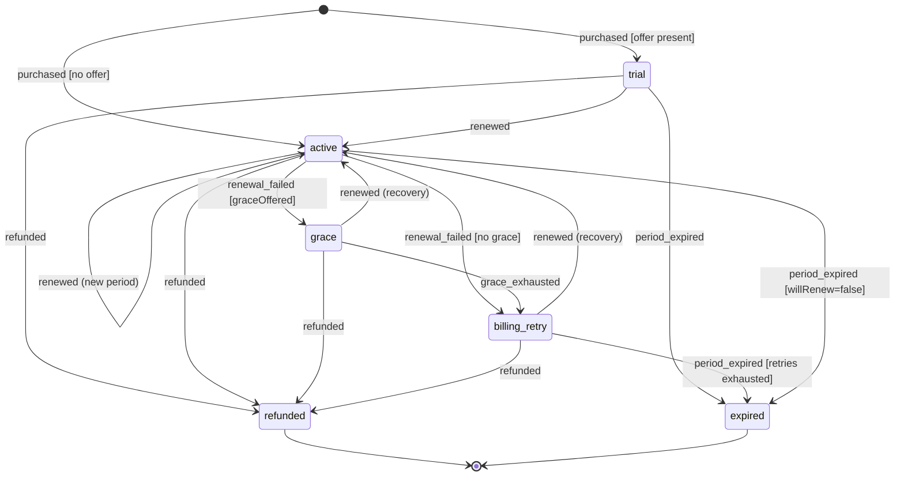

# 0009 — Entitlement domain model: state machines, unified ledger, idempotency, reconciliation

- Status: accepted
- Date: 2026-07-11
- Deciders: Ben Koo

## Context and problem statement

[ADR-0004](0004-payments-platform.md) decided *that* Irlo builds a provider-agnostic
entitlement service with an append-only ledger, and [ADR-0005](0005-member-experience-core.md)
decided *that* admission is a pure, audited state machine. Neither pinned down the domain
model precisely enough to implement against: exact states, events, and guards per rail;
where idempotency lives; what happens on out-of-order delivery; who wins when a rail and
local state disagree; and whether truth lives in an event log or in mutable rows. Those
answers must exist **before** the persistence substrate lands (C20–C22 in `NEXT_STEPS.md`
implement this ADR's tables on the C19 dev substrate), because the first schema *is* the
domain model.

This ADR refines ADR-0004 and ADR-0005 — it reverses no prior decision outcome; it makes
sketch-level details precise and amends the sketches where they were incomplete, with each
amendment listed explicitly under *Refinements to prior ADRs*.

## Decision drivers

- **D1 Exactly-once effects** over at-least-once, unordered provider delivery (ADR-0004 D1).
  Stripe explicitly does not guarantee event ordering; Apple resends notifications and can
  deliver the same economic fact under different envelopes.
- **D2 One queryable truth:** clients never compute entitlements; one server answer
  (ADR-0004 D2).
- **D3 Auditability:** every state and every balance derivable from an immutable history
  (ADR-0004 D3, ADR-0005 D4).
- **D4 O(1) read path:** `can(member, capability)` sits on the paywall and request path —
  one indexed read, never a log scan.
- **D5 Legibility and pure-core testability:** no implicit states in flag combinations;
  100% branch coverage gates must stay cheap to hold (ADR-0005 D1/D5).
- **D6 Rail symmetry:** downstream of normalization there are no provider branches; Apple
  and Stripe reduce to the same events, the same machine, the same ledger.

## Considered options

1. **Append-only truth logs + same-transaction projections** — the logs
   (`payment_events`, `ledger_entries`, `admission_events`) are the source of truth;
   current-state rows (`subscriptions`, `consumable_balances`, `applications`, entitlement
   view) are pure folds of the logs, updated in the same transaction as each append.
2. **Mutable subscription/entitlement rows + side audit log** — status columns updated in
   place; history recorded in a parallel audit table.
3. **Pure event sourcing** — no materialized current state; state replayed from the log on
   read (with snapshots), CQRS-style.

## Decision outcome

**Option 1.** Truth is append-only; reads are projections maintained transactionally with
the append, so there is no eventual-consistency window on the single write path, yet every
row remains rebuildable from history. The full model follows.

### 3a. Aggregates and identity

- **Member** (account) is the entitlement subject — never a device (ADR-0004 D2).
- **SubscriptionAggregate** — keyed `(provider, provider_subscription_id, generation)`.
  Apple: `originalTransactionId`; Stripe: `subscription.id`. **Generation** exists because
  Apple *reuses* `originalTransactionId` on resubscribe-after-expiry: a purchase landing on
  a terminal generation spawns `generation + 1` starting fresh, instead of resurrecting a
  terminal state. Stripe resubscribes mint a new `subscription.id`, so generation keying
  gives both rails identical semantics.
- **ApplicationAggregate** — keyed `(member, crew, generation)`; reapply after rejection is
  a new generation gated by `cooldownUntil`, never a reused record.
- **One append-only ledger** records every economic fact, in two shapes (this implements
  ADR-0004's "every grant/consumption/refund is an immutable ledger row" verbatim):
  - *countable credits*: `credit` / `debit` rows for `spark`, `undo`, `waitlist.skip`;
  - *time-bound grants*: `grant` / `reversal` rows for `irlo.plus` periods (one per paid
    period; natural key = provider transaction/invoice id).
- **Catalog mapping:** `spark.single`→+1 spark · `spark.pack5`→+5 · `undo.pack10`→+10 undo
  · `waitlist.skip`→+1 skip · `irlo.plus.monthly|yearly`→ irlo.plus grant for the period.
- **Single write path:** the only code that mutates aggregates or projections is the
  transition executor consuming normalized `PaymentEvent`s — webhooks, client JWS
  submissions, and reconciliation corrections all flow through it (invariant I14).

### 3b. Subscription state machine (per aggregate generation; 100% branch gate)

**States** — `trial`, `active`, `grace`, `billing_retry`, `expired`†, `refunded`†
(† terminal). Aggregate **context** (not states): `willRenew`, `currentPeriodEnd`,
`productId`, `offer`, `highWater` (last applied provider effective time).

**Entitling states:** `trial`, `active`, `grace`. `billing_retry` is **not** entitling —
Apple retains access during Billing Grace Period and drops it during post-grace billing
retry; Stripe `past_due` is aligned to the same policy (decision 1 below).

**Event mapping — Apple App Store Server Notifications V2** (type · subtype; see
[notificationtype](https://developer.apple.com/documentation/appstoreservernotifications/notificationtype)
and [subtype](https://developer.apple.com/documentation/appstoreservernotifications/subtype)):

| SNv2 notification | Normalized event | Transition + guard |
|---|---|---|
| SUBSCRIBED · INITIAL_BUY | `purchased` | `[*]→trial` if offer in transaction, else `[*]→active` |
| SUBSCRIBED · RESUBSCRIBE | `purchased` | on live generation: recorded no-op; on terminal generation: **spawn gen+1** at `[*]` |
| DID_RENEW (no subtype) | `renewed` | `trial→active` (conversion) · `active→active` (new period) |
| DID_RENEW · BILLING_RECOVERY | `renewed` | `grace→active` · `billing_retry→active` |
| DID_FAIL_TO_RENEW · GRACE_PERIOD | `renewal_failed(grace=true)` | `active→grace` |
| DID_FAIL_TO_RENEW (no subtype) | `renewal_failed(grace=false)` | `active→billing_retry` |
| GRACE_PERIOD_EXPIRED | `grace_exhausted` | `grace→billing_retry` |
| EXPIRED · VOLUNTARY / PRICE_INCREASE / PRODUCT_NOT_FOR_SALE | `period_expired` | `trial\|active→expired` |
| EXPIRED · BILLING_RETRY | `period_expired(retries_exhausted)` | `billing_retry→expired` |
| REFUND | `refunded` | any non-terminal → `refunded` + ledger reversal; on terminal: reversal + recorded no-op |
| REVOKE (family-sharing revocation) | `refunded` | folds into `refunded` (decision 3) |
| DID_CHANGE_RENEWAL_STATUS · AUTO_RENEW_ENABLED/DISABLED | `autorenew_set(bool)` | context only |
| DID_CHANGE_RENEWAL_PREF · UPGRADE | `plan_changed(immediate)` | context; the paired transaction carries the new grant |
| DID_CHANGE_RENEWAL_PREF · DOWNGRADE (or none) | `plan_changed(at_renewal)` | context only |
| RENEWAL_EXTENDED | `renewal_extended` | context: `currentPeriodEnd` extended |
| OFFER_REDEEMED · PRICE_INCREASE · CONSUMPTION_REQUEST | context / out of scope | recorded; CONSUMPTION_REQUEST handling deferred to Stage 4 |
| ONE_TIME_CHARGE | consumable `credit` | ledger path (Q6) — no subscription transition |

**Event mapping — Stripe** (see
[event types](https://docs.stripe.com/api/events/types); ordering caveat:
[webhooks — event ordering](https://docs.stripe.com/webhooks#event-ordering)):

| Stripe event | Normalized event | Transition + guard |
|---|---|---|
| checkout.session.completed | (linkage) | binds member ↔ customer/subscription; aggregate created when the subscription attaches |
| customer.subscription.created + invoice.paid (`billing_reason=subscription_create`) | `purchased` | `[*]→trial` if `status=trialing`, else `[*]→active` |
| invoice.paid (`billing_reason=subscription_cycle`) | `renewed` | `trial→active` · `active→active` · `grace\|billing_retry→active` (recovery) |
| invoice.payment_failed | `renewal_failed(grace=policy)` | `active→grace` — Stripe has no native grace; a **policy grace window** (config, aligned to the [smart-retry](https://docs.stripe.com/billing/revenue-recovery/smart-retries) schedule) applies; a scheduled local event emits `grace_exhausted` on lapse |
| customer.subscription.updated (`cancel_at_period_end`) | `autorenew_set(bool)` | context only |
| customer.subscription.updated (price/item change) | `plan_changed` | context; immediate vs at-renewal per proration behavior |
| customer.subscription.deleted | `period_expired` | `active→expired` (voluntary) · `billing_retry→expired` (retries exhausted) |
| charge.refunded (subscription invoice charge) | `refunded` | as Apple REFUND |
| charge.dispute.closed (lost) | `refunded` | chargeback = refund semantics |
| pause_collection, metered/usage events | unsupported | recorded + drift alert if observed (out of catalog scope) |

**Terminal-state rules:**

- `expired` and `refunded` never transition out — no exceptions, including reconciliation.
- An economic event addressed to a terminal generation appends its ledger row (money facts
  are always recorded) plus an audited no-op transition; a state-only event is an audited
  no-op.
- New entitlement after a terminal state is always a **new generation** (Apple RESUBSCRIBE,
  reconciliation-detected missed resubscribe) or a new provider subscription id (Stripe) —
  never `expired→active`.
- Admission terminals (`member`, `rejected`, `withdrawn`) are likewise absorbing; reapply
  is a new application generation gated by `cooldownUntil`.

### 3c. Admission state machine (per application generation; 100% branch gate)

**States** — `draft`, `submitted`, `under_review`, `waitlisted` (context: `lane ∈
{standard, priority}`; position always derived, never stored), `accepted`, `member`†,
`rejected`† (context: `cooldownUntil`), `withdrawn`†.

| Event | Transition | Guards |
|---|---|---|
| `submit` | draft→submitted | crew open · no live application for (member, crew) · cooldown elapsed |
| `auto_triage` | submitted→waitlisted | triage rules (queue-depth circuit breaker, ADR-0005) |
| `review_open` | submitted→under_review | actor holds `can(review)` |
| `queue_advanced` | waitlisted→under_review | slot opened · head of merged lane order |
| `decision(accept)` | under_review→accepted | actor + reason required |
| `decision(reject)` | under_review→rejected | actor + reason; sets `cooldownUntil` |
| `decision(defer)` | under_review→waitlisted | actor + reason |
| `skip_consumed` | **context only**: lane standard→priority | ledger credit ≥ 1 · lane = standard (one jump per application) · atomic with debit (I11) |
| `onboarding_complete` | accepted→member | — |
| `withdraw` | draft/submitted/under_review/waitlisted→withdrawn | actor = applicant |

- A paid skip reorders the queue (lane change); it never skips review itself — the
  `queue_advanced` state change is a separate event (fairness, ADR-0005 D2).
- **Double-approve race:** decisions execute under the aggregate row lock; a repeat
  *identical* decision is a recorded no-op; a *conflicting* decision on an already-decided
  application is a typed domain error. Never a second admission.

### 3d. Idempotency — three layers, each catching what the others cannot

| Layer | Mechanism | Catches |
|---|---|---|
| 1 · Inbox | `payment_events` row UNIQUE `(source, event_id)` — Apple `notificationUUID`, Stripe `event.id`, client submissions `(apple-client, transactionId)`, reconciliation `(recon, run:aggregate)` — inserted **in the same transaction** as all effects | exact redelivery of the same envelope |
| 2 · Ledger natural keys | UNIQUE deterministic key per row: credits/grants `(provider, transaction_or_invoice_id)` · spend-debits `(member, client_idempotency_key)` · refund-debits `(provider, refund_id)` (I2 — a *debit*, distinct from spend-debits by provenance, not `entryType`) · reversals (irlo.plus only) `(provider, refund_or_revocation_id)` | the same **economic fact** under a *different* envelope (Apple re-signs; client-JWS and ONE_TIME_CHARGE both deliver one purchase; a reconciliation correction pre-empting the late original event) |
| 3 · Monotonic state guard | per-generation `highWater` on provider effective time (Apple `signedDate`, Stripe `event.created`); total order `(effectiveAt, inbox_seq)` recorded on the log row; stale event → recorded no-op | out-of-order delivery regressing state |

Event-key dedupe alone misses same-fact-different-envelope; ledger uniqueness alone misses
state-only events (`autorenew_set` writes no ledger row). Layer 1 is the fast path, layer 2
the money invariant, layer 3 the state protector. Every inbox row records a **disposition**
(`applied | duplicate | superseded | no_op_terminal`) — the queryable evidence behind the
Stage 3 "webhook replay is a no-op" artifact. Client-initiated consumption (undo, skip)
carries a client-minted UUID idempotency key → layer 2.

### 3e. Dual-rail reconciliation — one truth, who wins

- **Per-provider authority (I13):** provider P's events mutate only P-owned aggregates.
  Apple is authoritative for Apple aggregates, Stripe for Stripe. A "Stripe cancel vs Apple
  renewal out of order" is a non-conflict *by construction* — different aggregates.
- **Entitlement projection = union:** a member has irlo.plus iff **any** generation of any
  aggregate is in an entitling state; consumable balances come from the ledger. Clients
  read only this projection (D2).
- **Local vs provider drift:** the nightly job **mutates nothing directly**. It fetches
  provider truth ([Apple Get All Subscription
  Statuses](https://developer.apple.com/documentation/appstoreserverapi/get_all_subscription_statuses);
  Stripe retrieve-subscription), diffs against projections using the same pure mapping the
  consumer uses, and enqueues `reconciliation.correction` events into the *same* consumer
  pipeline — single write path, all three idempotency layers, an audit row and an alert per
  correction, in both directions (grant-restoring and access-revoking). This sharpens
  ADR-0004's "drift alerts, never silent fixes": *fixes are allowed; silent is not.*
- **Consumption authority is local:** providers know purchases, not consumption. The ledger
  is authoritative for debits; reconciliation checks purchase-side completeness only.

### 3f. Domain invariants (each becomes a named test)

- **I1** Ledger and admission logs are append-only — no UPDATE/DELETE; corrections are
  compensating entries.
- **I2** A **spend-debit** (member-initiated consumption — undo, `waitlist.skip`) never
  takes a consumable balance below zero — row lock + guard in the debit transaction; C21
  ships no `DB CHECK(balance >= 0)`, because only the executor can tell a spend-debit
  (must be guarded) apart from a **refund-debit** (a provider refund of an already-spent
  pack, recorded as `debit` per Q6 — must *not* be guarded, since driving the balance
  negative there is the whole point: refunded-but-spent = member debt). The executor
  distinguishes them by natural-key provenance (member-minted idempotency key = spend;
  provider transaction/refund id = refund), not by `entryType` alone — both are `debit`
  rows. Balance < qty blocks further spends until future credits repay. Balance always
  equals Σ(ledger rows) — no clamping. *(Corrected 2026-07-11 alongside the Q6 fix: this
  invariant previously said "reversal," a row shape reserved for irlo.plus periods since
  §3a, and claimed a blanket DB CHECK C21 never shipped.)*
- **I3** Every ledger row has a unique natural key; replaying any event adds no row.
- **I4** Every processed event is in the inbox exactly once; inbox insert + all effects
  commit atomically (exactly-once effects over at-least-once delivery).
- **I5** Per-generation state is monotonic in `(effectiveAt, inbox_seq)`; stale events are
  recorded no-ops, never regressions.
- **I5a** High-water suppression applies to **state transitions only — never to ledger
  appends or period context**. A stale-but-economic event still appends its grant/credit
  and merges period context monotonically (`currentPeriodEnd := max(current, event period
  end)`); only the state change is suppressed. Named test:
  `server/test/payments/stale-economic-event.test.ts`.
- **I6** Terminal states absorb — no transition out, ever, including by reconciliation;
  post-terminal continuation is always a new generation.
- **I7** Projections are pure deterministic folds of the logs (versioned reducer),
  rebuildable to identical state; nothing writes projections except the transition executor.
- **I8** At most one live (non-terminal) application per (member, crew).
- **I9** Every decision/audit event carries actor, reason code, timestamp (ADR-0005 D4).
- **I10** `can()` is pure and I/O-free over (admission state, entitlement snapshot).
- **I11** Skip consumption is atomic with the lane move — both or neither.
- **I12** No effect from an unverified event: JWS/signature verification precedes
  normalization (verify-then-queue).
- **I13** Cross-rail isolation: provider P's events mutate only P-owned aggregates.
- **I14** Single write path: webhooks, client submissions, and reconciliation corrections
  all mutate state only through the one transition executor.

### 3g. Multi-fact envelopes (addendum, decided 2026-07-11 — code-reviewer approved)

**The gap.** `normalizeStripeEvent`'s `customer.subscription.updated` case checks
`previous_attributes.items` before `previous_attributes.cancel_at_period_end`, so a single
Stripe update touching both fields at once (rare — most dashboard/API actions send one
focused change, but real) normalizes to `plan_changed` only; the `autorenew_set` signal is
silently dropped rather than queued or merged. Left unresolved, a member who changes plan
and disables auto-renew in the same API call keeps `willRenew=true` in our projection, so the
voluntary-cancel path (`active + period_expired + !willRenew → expired`) never fires on
schedule. Two ways to stop dropping the second fact:

| | **(i) Facet-suffixed inbox keys** | **(ii) Combined consumer call** |
|---|---|---|
| Shape | `normalizeStripeEvent` emits one `NormalizedStripeEvent` per fact (two, for a combined update); each gets its own inbox row keyed `(source, event_id, facet)` | `normalizeStripeEvent` emits one envelope carrying an ordered, non-empty list of context facts; the executor folds each onto the aggregate in one transaction, one inbox row keyed `(source, event_id)` as today |
| Atomicity (D1, I4) | The unit of idempotency (one inbox row) stops equalling the unit of delivery (one Stripe `event.id`) — a combined update becomes two inbox rows in two transactions. A crash between them, or one facet's transaction failing after the other committed, leaves half a Stripe event applied, with no clean HTTP status for "partially applied" | `one txn = one inbox row = one Stripe event = one atomic fold` — the whole envelope commits or none of it does; no partial-application state is reachable |
| I4 fit | Reinterprets I4's "every processed event is in the inbox exactly once" as *per-fact*, not *per-envelope* — a live rewording of an existing invariant, not just a new case | Preserves I4 as written (§3d literally: "catches exact redelivery of the **same envelope**") — no invariant text changes, no reinterpretation |
| Schema/blast radius | `payment_events` UNIQUE constraint widens from `(source, event_id)` to `(source, event_id, facet)` — every inbox row across **both rails and reconciliation** (§3d's `(recon, run:aggregate)` key too) now needs a non-null `facet`, not just the four consumer functions' duplicate-detection path, for a Stripe-only edge case | Confined to `consume-context-event.ts` and the normalizer's `context_event` case; the other three consumer functions (purchase, subscription-economic, consumable-refund) and reconciliation are untouched |
| Executor fit | New concept (facet) threaded through every call site, every rail, and reconciliation | The executor already owns one transaction per call; folding N facets before a single insert is a small, local extension of `consumeContextEvent`'s existing loop-free body — and works with **zero reducer changes**: both facts share one `effectiveAt` (`event.created`) and touch disjoint fields (`productId`, `willRenew`), so `applyEvent`'s `effectiveAt < highWater` staleness check (not `<=`) never suppresses the second fold, and fold order doesn't affect the outcome |
| Apple-rail symmetry | If Apple's SNv2 payloads ever bundle multiple context facts in one notification (not observed to date), the facet key generalizes directly | Would need its own combined-fold executor call per rail, but Apple's notification shape is one-fact-per-notification today, so there's nothing to generalize to yet |
| D5 legibility | Two inbox rows for one HTTP delivery is a surprising read for anyone reconciling `payment_events` 1:1 against Stripe's dashboard event list | One inbox row per Stripe Dashboard event, matching what an operator sees when cross-referencing |

**Decided: (ii).** Code-reviewer-confirmed (2026-07-11, Opus 4.8/xhigh): the deciding argument
is atomicity, not legibility — (i) breaks "one Stripe event = one atomic unit," which is a
correctness regression on D1/I4, not merely a style preference, and its blast radius is wider
than the schema-only framing suggests once reconciliation's inbox key is accounted for. A
third option was considered and rejected: folding both field-deltas into one compound
`ContextEvent` variant is a degenerate form of (ii) that forces a new variant into the
`ContextEvent` union or overloads `applyContextEvent`, where (ii)'s list-fold reuses the
existing `autorenew_set`/`plan_changed` variants untouched and generalizes to N > 2 facts for
free.

**Implementation caveat:** the envelope is an ordered, **non-empty** list of context facts.
If a combined `customer.subscription.updated` touches only unmapped fields, the built fact
list is empty — the normalizer must fall back to `unsupported` in that case (as it already
does for the single-fact path today), never emit an empty-list envelope.

### 3h. Delivery semantics — Stripe webhook HTTP response mapping (addendum, 2026-07-11)

Not previously specified anywhere (§3e is dual-rail reconciliation authority, not HTTP
transport — a prior read of this ADR conflated the two). Stripe's webhook contract: any
non-2xx response is treated as "not delivered," and Stripe retries with backoff for up to
several days. The mapping must therefore return 2xx for everything the transactional inbox
(§3d) has durably recorded — recording **is** having handled the fact, whether or not it
changed anything — and reserve non-2xx for cases where redelivery could still help.

| Response | Applies to |
|---|---|
| **2xx** | Every outcome a consumer function reports as handled: `applied`, `duplicate`, `superseded`, `no_op_terminal`, `no_op_live` — the `payment_events.disposition` values actually written — **plus `generation_created`** (`consumePurchaseEvent`'s new-subscription outcome — internally persisted as `applied`, per consume-purchase-event.ts, but returned to the caller under its own name; the flagship "a member just started paying" case does not get to be an inference from the enum). `duplicate` is a legal disposition value but is never itself persisted — the delivery that would have written it aborts at the inbox insert instead — so read this row as "every outcome that means the fact is already recorded," not literally every value written to a row. All of these mean Stripe must not retry: the fact is already ours, whether or not it changed local state. |
| **400** | Signature verification failure (`verifyStripeWebhookEvent`'s `ok: false`). Not transient — the payload/signature won't become valid on retry. Stripe retries on **any** non-2xx, 400 included, same as it would a 5xx; 400 is chosen because it's the honest status for a malformed/unauthenticated request, not because it suppresses retries — those retries simply keep failing the same way and exhaust into Stripe's dashboard as permanently failed, which is the correct terminal state for a signature that will never verify. |
| **5xx** | Two genuinely transient cases: (a) an infrastructure fault during processing (DB connection failure, transaction abort unrelated to a business outcome) — the same envelope, redelivered later, has a real chance of succeeding once the fault clears; (b) `no_matching_generation` (`consumeContextEvent`/`consumeSubscriptionEconomicEvent` finding no row for the target `(provider, providerSubscriptionId)`) — Stripe does not guarantee event ordering (§3b), so a context or economic event can legitimately arrive before the `purchased` event that creates the generation; redelivery on Stripe's backoff schedule gives the missing generation time to show up. This outcome is **not** written to `payment_events` (the function returns before the inbox insert), so it falls outside the 2xx row above by construction, not by oversight. If the generation genuinely never arrives (broken member↔customer linkage), Stripe's retries exhaust after ~3 days and §3e's nightly reconciliation independently backstops persistent linkage drift — the 5xx choice doesn't risk unbounded retry. |
| **2xx + alert, not 5xx (Stripe rail only — see caveat)** | `ApplyEventDisposition: 'invalid'` (an off-graph event — §3f, `subscription-transition.ts`'s documented "mechanism TBD at executor-wiring time" seam, resolved here). On the Stripe rail, every reachable `invalid` reflects a domain-model gap (e.g. the parked `trial + renewal_failed` `TODO(decide)`) or a policy mismatch, not a transient fault — retrying changes nothing, so a 5xx here would make Stripe retry an event that will be invalid forever. The route acknowledges receipt (2xx, so Stripe stops retrying) and raises an operator alert (structured log at error level + metric increment; the ADR's TBD is resolved to "log and alert," not "write a disposition" — there is still no slot for `invalid` in `payment_events.disposition`, deliberately, per §3f). **Caveat for Stage 4 (Apple rail):** this "never retry" reasoning does not transfer as-is. Apple's `GRACE_PERIOD_EXPIRED` (`grace_exhausted`) is provider-delivered and can arrive *before* `DID_FAIL_TO_RENEW·GRACE_PERIOD` (`renewal_failed`) — a causally-early event, not a domain-gap one — landing as `active + grace_exhausted → invalid` with a *later* `effectiveAt` that the highWater guard (§3d layer 3) does not catch, since staleness only suppresses events that are behind highWater, not ahead of an unmet precondition. Treating that as "2xx, never retry" would silently strand the aggregate in entitling `grace` instead of dropping to non-entitling `billing_retry` — an entitlement leak, backstopped only by §3e's next reconciliation pass rather than caught immediately. The Apple-rail mapping (Stage 4) must distinguish a causally-early `invalid` (retry-recoverable — a 5xx candidate) from a genuine domain-gap `invalid` (2xx + alert, as here) before reusing this row's logic wholesale. |

**Replay/timestamp tolerance.** `Stripe.webhooks.constructEvent` accepts a tolerance window
(default 300s) rejecting a signed payload whose timestamp has drifted too far from now — a
defense against a captured valid signature being replayed outside the window it was issued
in. This is a **signature-layer** defense, orthogonal to the inbox's fact-layer dedupe (§3d
layer 1): tolerance stops an old *signature* from being accepted at all; the inbox stops an
accepted *event* from being applied twice. Neither substitutes for the other — an event
replayed within the tolerance window still hits the inbox and comes back `duplicate` (2xx,
no effect); an event outside the window never reaches normalization. Default tolerance is
kept as-is (no product reason yet to widen or narrow it); revisit only if evidence — e.g. a
slow-clocked deploy environment rejecting genuine deliveries — says otherwise.

The route's doc comment cites **this section (§3h)**, not §3e, for its disposition→HTTP
mapping.

### Decisions recorded (approved 2026-07-11)

1. `billing_retry` is **not entitling** (grace yes, retry no; matches Apple semantics).
2. Double subscription across rails: **flag via reconciliation, never block/auto-cancel**
   (edges discourage with 409 / manage-instead-of-buy UI).
3. Apple REVOKE **folds into `refunded`** (identical effects; one fewer terminal state to
   hold at 100% branch).
4. Refund-induced negative balances (a consumable refund recorded as a `debit`, per Q6 —
   not a `reversal`, reserved for irlo.plus periods) are **allowed as member debt, no
   clamping** (Σ-derivability preserved; spends blocked until repaid) — see I2.
5. **I5a** stale-but-economic events: suppression applies to state transitions only, never
   to ledger appends or period context.
6. **`payment_events.disposition` gains `no_op_live`** (2026-07-11, alongside the economic-event
   executor): a purchase/resubscribe event that lands on an already-live generation — validly
   processed (new inbox row; the ledger money-fact is idempotently recorded or already exists
   under a different envelope), but producing no new-generation effect. Distinct from
   `superseded` (I5/I5a staleness, keyed on `highWater`) and `no_op_terminal` (the generation
   here is live, not terminal) — the four-value enum had no slot for this, so it gets one
   rather than being force-mapped into `applied`.
7. **Multi-fact envelopes: combined consumer call, one inbox row per Stripe event** (§3g,
   2026-07-11, code-reviewer approved) — a `customer.subscription.updated` touching both
   `items` and `cancel_at_period_end` folds both context facts in one transaction under one
   `(source, event_id)` inbox row, rather than splitting into per-fact inbox rows keyed by a
   new `facet` column. Decided on atomicity (D1/I4): one Stripe event must stay one atomic
   unit, and a facet-keyed alternative would have widened `payment_events`' uniqueness key
   across both rails and reconciliation for a Stripe-only edge case.
8. **Stripe webhook disposition→HTTP mapping** (§3h, 2026-07-11) — 2xx for every outcome the
   inbox has recorded (including `generation_created`, `duplicate`, `superseded`,
   `no_op_terminal`, `no_op_live`); 400 for signature verification failure; 5xx only for
   transient infrastructure faults and `no_matching_generation` (an ordering-race Stripe's
   own retry schedule can resolve); `invalid` transitions get 2xx + operator alert on the
   Stripe rail specifically — Stage 4's Apple mapping must re-derive this row, since a
   causally-early Apple notification can produce `invalid` for reasons a blanket "never
   retry" rule would mishandle.

### Considered questions

**Q1 — Why are `grace` and `billing_retry` separate states?**
(1) They produce **different entitlement outputs** (grace entitling, retry not) — a
projection that is a function of state needs two states for two outputs; merging them would
hide the difference in a context flag, i.e. an implicit state, which ADR-0005 D1 forbids.
(2) **Different provider signals bound them**: Apple enters grace only via
DID_FAIL_TO_RENEW·GRACE_PERIOD and exits via GRACE_PERIOD_EXPIRED — the boundary is
externally observable, not inferred. (3) **Different exits**: grace exits by recovery or
window lapse; retry exits by recovery or retries-exhausted expiry. (4) The
**involuntary-churn recovery metric** (`docs/monetization.md` calls it "the state machine's
ROI") must distinguish recapture-in-grace from recapture-in-retry.

**Q2 — Out-of-order walkthrough: Stripe `invoice.payment_failed` arriving *after* the
recovering `invoice.paid`.**
Subscription S `active`; renewal fails at T1 (E1, `created=T1`); smart retry succeeds at T2
(E2, `created=T2`); Stripe delivers E2 first.
*E2 (`invoice.paid`, T2):* verify → normalize `renewed(effectiveAt=T2)` → txn: inbox insert
`(stripe, E2)` → ledger `grant` for the paid period, key `(stripe, invoice_id)` → state
`active→active`, period extended, `highWater := T2` → projection recomputed in-txn → commit.
*E1 (`invoice.payment_failed`, T1 < T2):* verify → normalize `renewal_failed(T1)` → txn:
inbox insert `(stripe, E1)` — new row; **layer 1 does not catch this: stale, not
duplicate** → no ledger fact (a failed payment moves no money) → layer 3: `T1 < highWater`
→ transition suppressed (would regress `active→grace`), disposition `superseded` → commit.
Net: state `active`, period correct, audit shows the failure was received and superseded.
In-order delivery yields the same final state (`active→grace→active`) — order-insensitive.
Any redelivery hits layer 1 → `duplicate`, zero effects.
*Variant — stale but economic (I5a):* aggregate `active`, `highWater = T3` (raised by an
`autorenew_set` context event). A renewal with `effectiveAt = T2 < T3` arrives late.
Layer 1: new inbox row. Layer 2: the grant's natural key is new → **the ledger append
happens** — money facts are never dropped for staleness. Period context merges
monotonically (`max`). Only the state transition is suppressed. The asymmetry is
deliberate: ledger rows are commutative facts; state is a latest-truth summary — had the
aggregate been in `grace` from a *newer* T3 failure, the late T2 payment must record its
grant yet must **not** fake a recovery to `active`.

**Q3 — Apple says `active`, local says `expired`: who wins, what mutates?**
**The provider wins for provider-owned subscription facts, always.** The provider moves the
money; local state is a derived cache of provider events plus local consumption. "We're
right and Apple is wrong about an Apple subscription" is not representable — the local
belief *is derived from* their signal. The nightly job fetches provider truth per live (and
recently-terminal) generation, diffs via the same pure mapping the consumer uses, and on
mismatch enqueues a `reconciliation.correction` event — it mutates nothing directly (I14).
Missing ledger facts are appended under the provider's *real* transaction ids, so a
late-arriving original webhook becomes a layer-2 no-op. For the asked case: `expired` stays
terminal (I6); the correction spawns a **new generation** seeded from provider truth with
`reconciliation` provenance and a `superseded_by` pointer on the old generation. The
reverse case (provider refunded, local active) is a normal non-terminal transition.
Consumption debits are the one locally-authoritative fact class; reconciliation never
touches them.

**Q4 — Projection vs ledger disagreement: rebuild semantics; is the projection ever
authoritative?**
Authority order is fixed: **provider > logs > projections**. The projection is *never*
authoritative — but it is **always the read path** (D4). Safe because projections update in
the same transaction as the log append: no eventual-consistency window exists on the single
write path, so disagreement is by definition a defect. Detection: the nightly job's local
phase re-folds logs and compares. Rebuild: under the executor's lock, delete projection
rows, re-fold the logs in the recorded `(effectiveAt, inbox_seq)` order with the versioned
reducer, write fresh rows — I7 guarantees convergence. Correctness lives in the write path;
the read path stays a dumb indexed read, so latency budgets never pressure correctness.

**Q5 — Double membership (one active subscription per rail).**
Prevention is best-effort at the edges (web checkout 409s when an entitling aggregate
exists; iOS paywall shows *manage*), tolerance is the domain rule — Apple purchases
complete out-of-band (App Store settings resubscribe, family sharing, ask-to-buy), so
coexistence must be modeled. Effective entitlement = **union** of entitling aggregates, not
"longest expiry" — entitlement is boolean and idempotent; there is no winner to pick.
Display expiry = max(`currentPeriodEnd`). Double-billing: reconciliation emits
`drift(double_subscription)` → support/UX nudge; never auto-cancel (decision 2).
Cancel-one-rail: `autorenew_set(false)` on rail A → `period_expired` at period end → A
`expired` → projection recomputes in the same transaction; the union holds via rail B —
continuous entitlement, no gap.

**Q6 — Consumables: grant/spend atomicity, idempotent spend under retry.**
*Grant (US-07):* client submits transaction JWS → server verifies → one txn: inbox insert
`(apple-client, transactionId)` + ledger `credit` with natural key `(apple, transactionId)`
+ balance `+= qty`. If the same purchase later arrives as SNv2 ONE_TIME_CHARGE (different
envelope), layer 1 does not dedupe it — layer 2's key does: one credit no matter how many
paths deliver the fact. *Spend:* request carries client-minted UUID key K. One txn:
`SELECT … FOR UPDATE` on the (member, credit_type) balance row → INSERT `debit{qty,
key:(member,K)}` — unique-violation ⇒ already succeeded: replay the original success, no
second debit → guard `balance ≥ qty` else typed `insufficient_credits` (rollback) → balance
`-= qty` → apply the domain effect in the same txn (lane move / undo marker — I11) →
commit. Racing spends serialize on the lock; the loser gets `insufficient_credits`. A
refund of a partly-spent pack appends a `debit` for the full refunded quantity — not a
`reversal`, which is reserved for the grant/reversal (irlo.plus period) row shape; balance
may go negative (member debt; decision 4). *(Correction, 2026-07-11: this paragraph
originally said "reversal," contradicting §3a's own two-shapes definition — credit/debit
are the countable consumable rows, grant/reversal are irlo.plus-only — and C23's ledger
repository correctly implemented the credit/debit half. Caught by review while building
C23, before the Stage 4 App Store consumable-refund path could inherit the wrong shape.)*

### Refinements to prior ADRs

Against **ADR-0004**'s sketch: (1) entry at `active` when no offer exists; (2) refund
reachable from every non-terminal state, not only `active`; (3) REVOKE folds into
`refunded`; (4) grace entry is guarded — not all rails/products offer it, Stripe's is
policy-defined; (5) voluntary cancel = `willRenew=false` context + later `period_expired`,
not an immediate transition; (6) generation keying for resubscribe; (7) "drift alerts,
never silent fixes" sharpened to *fixes allowed, silence not* — corrections are evented,
audited, alerting. Against **ADR-0005**'s sketch: (8) `withdrawn` added as a terminal
state; (9) the "slot opens / skip consumed" edge splits into `queue_advanced` (state) and
`skip_consumed` (lane context).

### Positive consequences

- Exactly-once *effects* on an at-least-once, unordered world — provable with fixture
  replays and out-of-order tests, not asserted.
- The core correctness follow-ups of `docs/interview/design-drills.md` drills ① and ② —
  who wins, where dedupe lives, double-approve, replay-is-a-no-op — now have designed,
  documented answers (scale/throughput follow-ups remain load-test-plan territory).
- C20–C25 implement tables and reducers this ADR fully specifies — no schema improvisation.
- The audit trail is the data model, not a bolt-on; refunds, debt, and reconciliation
  corrections are ordinary rows.

### Negative consequences

- Generation keying and disposition tracking add columns and concepts a naive
  status-column design would skip; the legibility cost is paid in this ADR.
- Stripe's grace window is policy, not provider truth — one knob of business config that
  must be tested with test clocks rather than fixtures alone.
- Projections must never be written outside the executor; that discipline is enforced by
  convention + reconciliation detection, not by the database itself.

## Pros and cons of the options

| Driver | 1. Logs + txn projections | 2. Mutable rows + audit log | 3. Pure event sourcing |
|---|---|---|---|
| D1 Exactly-once effects | ✅ natural keys live in the truth log | ⚠️ dedupe re-invented per handler | ✅ same as 1 |
| D2 One queryable truth | ✅ one projection, one reader | ✅ one table | ⚠️ truth vs cache split on read |
| D3 Auditability | ✅ log **is** the truth | ❌ dual-write: audit can silently disagree with rows | ✅ log is the truth |
| D4 O(1) read path | ✅ indexed row, same-txn fresh | ✅ indexed row | ❌ replay/snapshot infra on hot path |
| D5 Legibility/testability | ✅ pure reducers; invariants are SQL properties | ❌ guards scattered in handlers (ADR-0005's anti-pattern, one level up) | ⚠️ pure but heavy harness |
| D6 Rail symmetry | ✅ one normalized log | ⚠️ per-rail columns accrete | ✅ |
| Rebuild/backfill | ✅ re-fold logs | ❌ history lossy — impossible | ✅ native |
| Portfolio/JD value | ✅ the pattern the drills probe | ❌ the anti-pattern they expose | ⚠️ over-engineered at this scale |

Option 2 fails D3 structurally: when status columns are the truth, the audit log is a
best-effort mirror, and the one thing an audit must guarantee — that it cannot disagree
with reality — is exactly what dual writes cannot guarantee. Option 3 buys nothing over
option 1 at Irlo's scale (option 1 already has the log as truth and full rebuildability)
while paying for snapshotting, reducer versioning on the read path, and cache-staleness
management; option 1 is its upgrade path if scale ever demands it.

## Links

- Refines [ADR-0004](0004-payments-platform.md) — dual rail, one entitlement truth
- Refines [ADR-0005](0005-member-experience-core.md) — admission, capability gating, audit
- [ADR-0003](0003-backend-platform.md) — Postgres/Redis/BullMQ substrate these tables land on
- `docs/monetization.md` — catalog and grace/retry recovery metrics
- User stories US-01, US-02, US-04, US-07–US-10 — `docs/user-stories.md`
- Apple: [App Store Server Notifications V2 types](https://developer.apple.com/documentation/appstoreservernotifications/notificationtype) · [subtypes](https://developer.apple.com/documentation/appstoreservernotifications/subtype) · [Get All Subscription Statuses](https://developer.apple.com/documentation/appstoreserverapi/get_all_subscription_statuses)
- Stripe: [event types](https://docs.stripe.com/api/events/types) · [webhook event ordering](https://docs.stripe.com/webhooks#event-ordering) · [Smart Retries](https://docs.stripe.com/billing/revenue-recovery/smart-retries)

## Future trends & implications

Apple keeps shifting from receipts toward signed JWS state and richer server APIs; because
every Apple fact enters through verify → normalize, notification-schema evolution lands in
one mapping table, not in domain code. Stripe's push toward usage-based and hybrid billing
maps onto the same ledger — metered entitlements are new row kinds and one more reducer
case, not a redesign. Regulatory momentum (EU DMA, US anti-steering) keeps expanding
out-of-app purchasing, which multiplies rails; per-provider authority plus union
entitlement is the shape that absorbs a third rail without touching the machines. And as
LLM-assisted support tooling reaches billing operations, an append-only, disposition-tagged
event history is precisely the substrate that lets an agent explain any member's
entitlement state — or any drift correction — from rows rather than archaeology.
