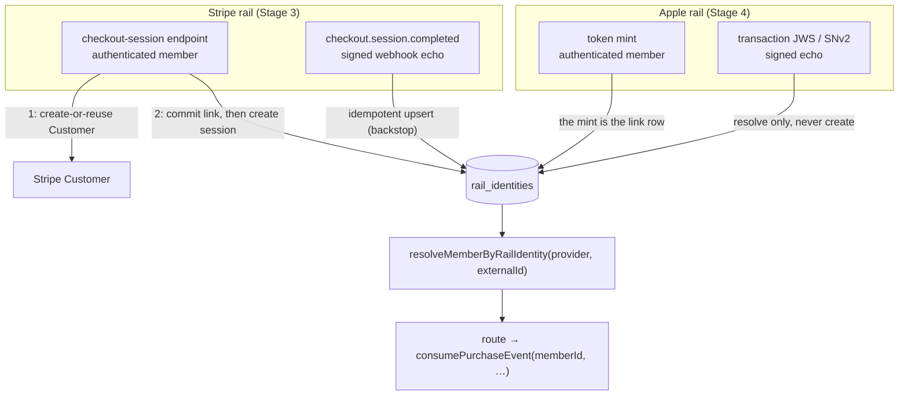

# 0011 — Member↔rail-identity linkage: identity table, link creation, out-of-order delivery

- Status: accepted
- Date: 2026-07-14
- Deciders: Ben Koo

## Context and problem statement

[ADR-0009](0009-entitlement-domain-model.md) gave every event type a designed path except
one: generation-spawning purchases. `consumePurchaseEvent` requires a caller-supplied
`memberId`, and nothing in the schema maps a payment-rail identity (a Stripe customer, an
Apple app-account token) to an Irlo member — `members` has no linkage column, and
`normalizeStripeEvent` deliberately leaves `checkout.session.completed` unmapped
("member↔customer linkage — the executor's job, not the reducer's"). The webhook route
therefore ships a logged + alerted 5xx stub for `purchase_event`
(`server/src/routes/stripe-webhook.ts`), a real tested branch recorded in `NEXT_STEPS.md`
(2026-07-12) as blocked on this ADR. The blocker is exactly as narrow as it looks:
`consumeSubscriptionEconomicEvent` and `consumeContextEvent` derive the member from the
aggregate row they lock, and `consumeConsumableRefund` has no Stripe caller by design —
only the brand-new-subscription path is blocked.

This ADR decides the linkage model: where the mapping lives, when and by whom links are
created, what happens when a purchase event arrives before its link, how the model extends
to the Apple rail (Stage 4), and the observable definition of the stub's retirement. It
refines ADR-0009 — two amendments, listed under *Refinements to prior ADRs* — and reverses
nothing.

## Decision drivers

- **D1 Trust boundary:** no client-claimable linkage. Whoever controls a client must not be
  able to attach a rail identity to another member's account (entitlement takeover), nor
  attribute purchases — and the refund/chargeback churn that follows them — to a victim.
- **D2 Exactly-once preservation:** ADR-0009 §3d's three idempotency layers and I14's
  single write path stay exactly as accepted; linkage must not open a second write path
  into money effects.
- **D3 Rail symmetry (ADR-0009 D6):** one mapping, one resolver, no provider branches
  downstream; a third rail costs one identity row shape and one authenticated-channel
  flow, not a redesign.
- **D4 Entitlement latency (US-09):** web purchase unlocks iOS "within seconds" — on the
  designed path, not by retry luck.
- **D5 O(1) hot path:** webhook-time member resolution is one indexed read (ADR-0009 D4's
  discipline, applied to the write path's lookup).
- **D6 PII minimization:** the mapping holds opaque identifiers only; erasing a member
  leaves every provider-side copy meaningless.
- **D7 Minimal blast radius:** the smallest possible delta to accepted ADR-0009 semantics,
  measured explicitly in §3f below.

## Considered options

1. **One provider-agnostic `rail_identities` table** — `(member, provider, external_id)`
   rows, UNIQUE on `(provider, external_id)`, one member to many identities.
2. **Per-rail columns on `members`** — `stripe_customer_id` now, an Apple column at
   Stage 4, each nullable + unique.
3. **Per-rail link tables** — `stripe_customers` and `apple_account_tokens`, each with its
   own shape and resolver.

## Decision outcome

**Option 1.** One table, both rails, one resolver. The model in full:

### 3a. Identity model — the `rail_identities` table

- **Shape:** `rail_identities(id, member_id FK→members NOT NULL, provider
  [the existing `subscription_provider` enum], external_id text NOT NULL, linked_via text
  NOT NULL, created_at)`, with `UNIQUE(provider, external_id)` and an index on
  `(member_id, provider)` for reverse lookup. `linked_via` is free-text provenance with a
  documented vocabulary (`checkout_session` · `checkout_session_completed` · `minted` ·
  `client_transaction` · `operator` · `reconciliation`) — free text over an enum for the
  same reason `payment_events.source` is (a new provenance costs a row, not a migration).
  Reusing `subscription_provider` for an identity table is a deliberate naming trade-off:
  the enum outgrows its prefix here, but a rename is a standalone migration with zero
  behavioral payoff — deferred until a second non-subscription consumer exists.
- **Cardinality:** one member : many rail identities; each identity : exactly one member,
  forever. The 1:N is real *within Stripe alone*: a support-deleted-and-recreated Customer
  yields a second `cus_…` id while the old one still has a live refund/chargeback window
  whose late webhooks must keep resolving (§3f). Reverse lookups that want "the" identity
  (checkout-time Customer reuse) take the newest row for `(member, provider)`.
- **Canonical identifier per rail:**
  - **Stripe → Customer id (`cus_…`).** Present on every object class the rail consumes
    (invoice, subscription, charge), exists *pre-purchase*, stable across subscriptions.
    Rejected: `subscription.id` — post-purchase only, and that mapping already lives in
    `subscriptions.memberId` once a generation exists.
  - **Apple → `appAccountToken`** (a server-minted UUID, §3b/§3c). The only member marker
    Apple echoes across both subscriptions *and* consumables. Rejected as identity:
    `originalTransactionId` — it is the aggregate key, exists only post-purchase, and has
    no cross-product continuity (each consumable purchase starts its own transaction
    lineage).
- **What this table is not:** an aggregate or a projection. I14's single-write-path rule
  governs aggregates and projections; `rail_identities` is edge identity data with its own
  narrow writers — the checkout endpoint (primary), the linkage consumer (backstop), and
  audited operator action. The transition executor neither reads nor writes it: the route
  resolves the member first, then calls `consumePurchaseEvent` with its signature
  unchanged.

### 3b. Link creation — authenticated channels only

The generalizing rule, stated once and reused per rail: **every rail has exactly one
authenticated channel and one signed-but-unauthenticated channel; links are created on the
authenticated channel and consumed on the webhook channel.** Stripe's authenticated channel
is pre-purchase (our checkout endpoint); Apple's is the server-minted token the client
attaches at purchase — inverted direction, same model.

- **Primary (Stripe):** the Stage 3 checkout-session endpoint, on an authenticated member's
  request: create-or-reuse the Stripe Customer → **commit the `rail_identities` row** →
  create the Checkout Session with `customer`, `client_reference_id = memberId`, and
  `subscription_data.metadata.member_id` (a provider-held copy Stage 5 reconciliation can
  cross-check). The link commits before the payment form exists, so no purchase webhook
  can precede it on this path — the ordering problem of §3d is solved at *creation* time,
  not consumption time.
- **Backstop (Stripe):** a `checkout.session.completed` consumer performs an idempotent
  upsert from the session's `(customer, client_reference_id)`. Legitimacy chain: both
  values were set by *our server* at session creation and arrive back inside a
  Stripe-signed payload — server-set evidence under a provider signature, never client
  assertion. The backstop exists for the two-phase crash window (Customer created at
  Stripe, our DB commit failed before the row landed) — a gap the primary path alone
  cannot close.
- **Apple (Stage 4; the model is fixed now, the flows land then):** the server mints the
  `appAccountToken` — the `rail_identities` row *is* the mint (`linked_via = 'minted'`) —
  the client sets it in StoreKit purchase options, and Apple echoes it inside every signed
  JWS transaction and SNv2 notification. Verified JWS submissions and notifications
  *resolve* through the token; they never create links.
- **`NormalizedStripeEvent` gains a `linkage_event` kind** for
  `checkout.session.completed` — ADR-0009 §3b's `(linkage)` placeholder row made concrete.
  The normalizer's kinds are route-dispatch tags, and the route's uniform
  dispatch-on-kind shape is worth preserving; whether the customer/member fields ride the
  normalized envelope or are extracted at the route follows the module's existing
  minimal-`Pick` pattern (triplet detail, not an ADR concern).

**Linkage consumer outcomes** (mirrors ADR-0009 §3h's structure; no new
`payment_events.disposition` values anywhere):

| Outcome | Meaning | HTTP | Inbox row |
|---|---|---|---|
| `linked` | new link committed | 2xx | yes — `applied` |
| `already_linked` | identical link pre-exists (primary path won, or same fact under a different envelope) | 2xx | yes — `applied`. Not `no_op_live`: that value is documented as purchase-on-live-generation (ADR-0009 decision 6); `applied` already means "the event's effects hold" |
| `duplicate` | same envelope redelivered — §3d layer 1 | 2xx | pre-existing; the insert aborts, classified outside |
| `conflict` | identity already linked to a **different** member | 2xx + alert | none — returns before the inbox insert (mirrors §3h's `invalid`: retrying never resolves it; deliberately no disposition slot). With no inbox row, layer 1 never dedupes this envelope: the alert fires on the initial delivery and again on any at-least-once duplicate Stripe sends — loud is correct for a fraud-shaped signal. Recovery is explicit, never silent — §3f |
| `member_not_found` | `client_reference_id` names no member (deleted between session creation and completion) | 2xx + alert | none — same reasoning |
| `unattributable` | session lacks `client_reference_id` or `customer` — a session our endpoint didn't create | 2xx + alert | none |

### 3c. Linkage invariants (L-series; each becomes a named test, like I1–I14)

- **L1** A link is created only from (a) an authenticated member session whose evidence the
  *server* hands to the rail, (b) a provider-signed payload echoing such server-set
  evidence, or (c) audited operator action.
- **L2** Client-supplied identifiers are never link evidence — no API accepts "my customer
  id is X". This is what rules out `appAccountToken = memberId`: the token is a
  client-controllable purchase field, and Apple's signature proves the client *set* it, not
  that it's *theirs*. A minted token resolves only if the server created that row for that
  member; an unknown token resolves to nothing.
- **L3** `UNIQUE(provider, external_id)`: an identity maps to at most one member, ever. A
  conflicting claim is a typed error + operator alert — never a silent repoint.
- **L4** Link rows are immutable — no `member_id` UPDATE; corrections are audited operator
  delete + recreate.
- **L5** Resolution on the webhook path is one indexed read.

### 3d. Out-of-order arrival — 5xx-until-linked, parking rejected

A purchase webhook can reach us before its link exists. Three mechanisms were compared:

| | **(i) 5xx-until-linked** | **(ii) park in `payment_events`, replay on link** | **(iii) quarantine table, replay on link** |
|---|---|---|---|
| Delivery ownership | Stripe's at-least-once retry (exponential backoff, up to ~3 days — §3h) remains the delivery mechanism; we remain a pure acknowledger | A redelivery-while-parked hits `UNIQUE(source, event_id)` → classified `duplicate` → 2xx → **Stripe stops retrying**; the local replay job becomes the sole delivery path for a money fact — provider at-least-once downgraded to at-most-once on our own bug budget | 2xx on park; the same sole-delivery shift as (ii), durable in a side table instead of the inbox |
| §3d fit | Unchanged — returns before the inbox insert, the exact shape §3h already blessed for `no_matching_generation` | An inbox row comes to mean "recorded but **not** applied," and its disposition must mutate `parked → applied` later — the inbox stops being an immutable processing record | Inbox semantics untouched, but a second durable store of unapplied money facts appears beside it |
| I14 fit | One write path; the route gains only a read (the resolver) | A replay executor is a second entry point mutating aggregates | Same second entry point |
| Latency to entitlement | Primary path: zero — the link precedes the session (§3b). Backstop path: one Stripe retry (minutes-scale) | Immediate on link creation | Immediate on link creation |
| Blast radius | One new route outcome (`unlinked_customer`), one §3h row extension | New disposition value + disposition mutability + replay machinery across §3d/§3h | New table + replay machinery |

**Decided: (i).** The deciding argument is delivery ownership (D2), not simplicity: (ii)
and (iii) both convert Stripe's at-least-once guarantee into an at-most-once local replay
obligation for money facts, and (ii) additionally makes inbox dispositions mutable — the
same correctness-regression class as §3g's rejected facet-key option. (i) extends §3h's
existing reasoning: `unlinked_customer` and `no_matching_generation` are the same shape —
an event arriving before its prerequisite, where provider redelivery genuinely resolves.
The two cases *compose*: an unlinked purchase 5xxes, its dependent economic events 5xx on
`no_matching_generation`, and once the link lands the retries drain in causal order
(purchase must apply before any dependent can) well inside the 3-day budget, with Stage 5
reconciliation as the designed backstop past it.

**The honest limit:** a *permanently* unlinked customer is an information gap no mechanism
fixes — parking included. If nothing maps the customer, there is no member to credit;
reconciliation flags it, an operator links (audited, L1c), and the next retry applies.

**Interim note (READMEs stay truthful, so ADRs do too):** until §3b's checkout endpoint
lands (slice D in `NEXT_STEPS.md`), the backstop is the only link creator, so a purchase
event racing ahead of `checkout.session.completed` waits one Stripe retry — a window of
webhook-delivery jitter between two events fired at the same instant, bounded by the
retry schedule. And that presumes a completed session exists at all: in production,
nothing creates checkout sessions until slice D ships, so every real-world purchase stays
`unlinked_customer` after slice C alone — the C↔D dependency `NEXT_STEPS.md` records.
Both windows close when D lands.

**Latency counterargument, answered:** on the backstop path, entitlement waits minutes, in
tension with US-09's "seconds." But the only flows on the backstop path are ones that
bypassed creation-time linking — the crash window and foreign sessions. Accepting
minutes-on-crash-recovery beats opening a second write path into money effects.

### 3e. Rail symmetry — what each rail needs

| | Stripe (Stage 3) | Apple (Stage 4) |
|---|---|---|
| Canonical identity | Customer id — provider-assigned, we record | `appAccountToken` — we assign, provider echoes |
| Authenticated channel (creates links) | checkout-session endpoint, pre-purchase | token mint; the authenticated client JWS submission then rides the same token |
| Signed echo channel (consumes links) | webhooks; `checkout.session.completed` doubles as the backstop *creator* because it echoes server-set evidence under Stripe's signature | SNv2 notifications, verified JWS submissions |
| Identity on every consumed object? | yes — `customer` rides invoice, subscription, and charge | no — tokenless transactions exist (legacy or a client that failed to attach it): fall back to `originalTransactionId` → existing aggregate row; a tokenless *first* purchase with no aggregate is unattributable → 5xx per §3d, against Apple's own retry budget (≈5 resends spread over ~3 days; exact schedule to verify against Apple's docs when Stage 4 lands) |
| Rejected identity keys | `subscription.id` (§3a) | `originalTransactionId` as identity (§3a); `memberId` as token (L2) |

Downstream of the resolver there are no provider branches: `resolveMemberByRailIdentity`
returns a member or nothing, and the executor never learns which rail's identity resolved
it (D3).

### 3f. Unlink, deletion, PII — and the blast radius on ADR-0009

- **Conflicts:** typed + alerted, never repointed (L3/L4) — §3b's outcome table. The 2xx
  means Stripe schedules no retries (the alert fires on the initial delivery and on any
  at-least-once duplicates), so the recovery chain is named here rather than implied:
  Stage 5 reconciliation flags the drift → the operator resolves the conflict (audited
  delete + recreate, L4) → the purchase events the conflict stranded apply via their own
  still-running `unlinked_customer` retries (§3d), or — past Stripe's ~3-day window —
  via **Stripe's manual event resend** of the original envelope, which re-enters the
  route as an ordinary delivery. The drop is visibly recoverable, not silent.
- **Customer re-creation:** a new row; the old row is retained so the replaced customer's
  late refund/chargeback webhooks still resolve. This is the 1:N justification, not an
  edge case to paper over.
- **Member deletion:** `rail_identities` rows die with their member (FK cascade policy;
  the full deletion design is deferred — no auth exists yet, and this table adds no new
  obstacle to it). Provider-side copies become dangling opaque UUIDs: the minted Apple
  token means Apple's permanent transaction history holds a value that is meaningless once
  our row is gone — the erasure story D6 asks for.
- **PII:** the table holds opaque identifiers only — never emails or names (Stripe keeps
  its own customer PII; we don't mirror it). The member UUID flowing into Stripe
  subscription metadata is accepted: it is opaque, and it buys Stage 5 drift-detection a
  provider-held cross-check. `payment_events.payload` retention (raw provider payloads) is
  pre-existing scope, explicitly untouched here.

**Blast radius, measured (D7):**

- *New:* the `rail_identities` table (a Stage 3 migration slice — not a C21 reopen); the
  linkage consumer; the `linkage_event` normalizer kind; the resolver; invariants L1–L5.
- *Amended in ADR-0009 (recorded here, backlinked there):* §3h's 5xx row gains
  `unlinked_customer` as case (c), same reasoning as case (b); §3b's
  `checkout.session.completed | (linkage)` placeholder row is concretized by §3b above —
  its own text ("binds member ↔ customer/subscription") holds as written.
- *Explicitly untouched:* every existing table's columns (`members` included); the
  `payment_events.disposition` enum (all five values, nothing added); invariants I1–I14;
  §3d's three layers; §3g; the reducers; and all four consumer functions' signatures and
  semantics — `consumePurchaseEvent` still takes `memberId`; the route resolves it.

### 3g. Retirement of the 5xx stub — the observable definition of implemented

The route's `purchase_event` branch stops returning `member_linkage_not_implemented`:
resolver hit → `consumePurchaseEvent` → 2xx (`generation_created` | `no_op_live` |
`duplicate`); resolver miss → 5xx `unlinked_customer` + alert + zero rows written. This
ADR is implemented when the following named tests exist and pass:

1. The existing stub-branch fixture test **mutates into** the `unlinked_customer` test —
   same assertions (5xx + alert + zero rows), new meaning (no link found, not
   not-implemented).
2. Linked-customer golden path: link row present → `invoice.paid`
   (`billing_reason=subscription_create`) fixture → 200, generation row, ledger grant,
   inbox `applied`.
3. Linkage consumer: link created + inbox row; redelivery → `duplicate`; conflict → 2xx +
   alert + no repoint (L3); `already_linked` → 2xx no-op.
4. **The flagship out-of-order pair:** purchase fixture → 5xx `unlinked_customer`;
   `checkout.session.completed` fixture → link; the *same* purchase envelope re-posted
   (Stripe redelivery semantics) → 200 `generation_created`.

### Decisions recorded (approved 2026-07-14)

1. **Identity model:** one provider-agnostic `rail_identities` table;
   `UNIQUE(provider, external_id)`; one member : many identities; provenance in
   `linked_via` (§3a).
2. **Canonical identifiers:** Stripe = Customer id; Apple = server-minted
   `appAccountToken` — `memberId`-as-token ruled out by L2 (§3a, §3c).
3. **Link creation:** authenticated channels only (L1); Stripe primary at
   checkout-session creation (link commits before the session exists),
   `checkout.session.completed` as the signed-echo backstop; Apple mint at Stage 4 (§3b).
4. **Out-of-order:** 5xx-until-linked retained, route outcome `unlinked_customer`;
   parking in the inbox or a quarantine table rejected on delivery-ownership grounds
   (§3d); ADR-0009 §3h's 5xx row gains case (c).
5. **Inbox semantics:** the linkage consumer writes inbox rows (`applied`) for
   `linked`/`already_linked`; `conflict`/`member_not_found`/`unattributable` return 2xx +
   alert *before* the inbox insert; the disposition enum is unchanged (§3b).
6. **Deletion/PII:** link rows are immutable and die with their member; superseded
   customer rows are retained for late refund resolution; the mapping stores opaque ids
   only (§3f).

### Refinements to prior ADRs

Against **ADR-0009**: (1) §3h's 5xx row extends with `unlinked_customer` — an
ordering-race case with the identical redelivery-resolves reasoning as
`no_matching_generation`; (2) §3b's `(linkage)` placeholder row is concretized as the
`linkage_event` kind + consumer of §3b above. Against **ADR-0004**: "grants keyed to
member, not device" gains its mechanism — a completion, not an amendment.

### Positive consequences

- The last undesigned event path is designed; the 5xx stub retires against named tests
  (§3g), and the Stage 3 "webhook replay is a no-op" evidence artifact can include the
  purchase path.
- Anti-takeover holds by construction (L1–L4), not by review vigilance — conflicts are
  schema violations, not code-path discipline.
- Stage 4 arrives with its linkage model already decided: Apple implements §3b/§3e; no
  fresh design pause for linkage.
- A third rail costs one identity row shape and one authenticated-channel flow (D3).

### Negative consequences

- One more table, repository, and consumer before the first purchase applies — real
  machinery for a mapping a naive design would jam into a column.
- Until slice D lands, backstop-path entitlement latency is one Stripe retry (§3d's
  interim note) — visible in the out-of-order test, honest in the docs.
- Conflict/unattributable alerts need a runbook entry once Stage 5's drift vocabulary
  exists.
- The minted Apple token adds a pre-purchase client↔server interaction Stage 8 must
  design for (offline purchase paths especially).

## Pros and cons of the options

| Driver | 1. `rail_identities` table | 2. members columns | 3. per-rail tables |
|---|---|---|---|
| D1 trust boundary | ✅ provenance column + L-invariants | ⚠️ invariants possible, provenance homeless | ✅ possible, duplicated twice |
| D2 §3d/I14 preserved | ✅ resolver is a read | ✅ | ✅ |
| D3 rail symmetry | ✅ one resolver, provider is data | ❌ per-rail columns accrete (0009 D6 anti-pattern) | ⚠️ two shapes, provider branch in the resolver |
| Cardinality truth | ✅ 1:N native | ❌ 1:1 hardcoded — customer re-creation orphans or overwrites | ✅ |
| D6 PII/erasure | ✅ rows die with member, opaque ids | ⚠️ columns null out, provenance lost | ✅ |
| D7 blast radius | ✅ additive table | ✅ smallest diff | ⚠️ two of everything |

Option 2's fatal flaw is cardinality, not style: a support-recreated Stripe Customer
either orphans the old id (its late refund webhooks stop resolving — money facts dropped)
or overwrites it (history lost); both are I-series violations waiting to happen. Option 3
is Option 1 with the provider column denormalized into table names — the resolver grows
exactly the provider branch D3 exists to forbid.

## Links

- Refines [ADR-0009](0009-entitlement-domain-model.md) — §3b's `(linkage)` row
  concretized; §3h's 5xx row gains `unlinked_customer`
- [ADR-0004](0004-payments-platform.md) — "grants keyed to member, not device" gains its
  mechanism
- [ADR-0005](0005-member-experience-core.md) — capability gating downstream of the
  entitlements this unblocks
- `NEXT_STEPS.md` — Stage 3 blocker note (2026-07-12) and implementation slices A–D
- User stories US-07, US-09, US-10 — `docs/user-stories.md`
- Stripe: [Checkout Session object](https://docs.stripe.com/api/checkout/sessions/object)
  (`client_reference_id`, `customer`) ·
  [webhook retries](https://docs.stripe.com/webhooks) ·
  [event ordering](https://docs.stripe.com/webhooks#event-ordering)
- Apple: [appAccountToken](https://developer.apple.com/documentation/appstoreservernotifications/appaccounttoken)
  · [App Store Server Notifications V2](https://developer.apple.com/documentation/appstoreservernotifications)

## Future trends & implications

Regulatory pressure (EU DMA, US anti-steering) keeps multiplying purchase surfaces —
external-purchase links, web shops for mobile apps, alternative marketplaces — and every
new surface is a new rail identity, not a new entitlement model: the table absorbs each as
rows plus one authenticated-channel flow. Apple's own trajectory (appAccountToken, signed
JWS state, richer server APIs) is toward exactly the server-minted-identity pattern L2
assumes, and Stripe's (Checkout metadata, `client_reference_id`) toward server-set
evidence echoed under signature — both rails are converging on the trust chain this ADR
standardizes. And as LLM-assisted support tooling reaches billing operations, "which
member owns this provider identity, who linked it, when, and via what evidence" becomes an
agent-answerable query over `linked_via` provenance rows — the same
rows-over-archaeology property ADR-0009 built for entitlement state, extended to
identity.
