# AI-native methodology — prompt · context · harness · loop

This repo is built with Claude Code as a first-class engineering tool, and the
workflow itself is a deliverable: documented, versioned, and eval-gated
(`docs/ai/evals.md`). It evidences two JD rows at once — "enthusiasm around new
AI tools" and "productivity-obsessed" — with artifacts, not adjectives.

## The four layers

1. **Context engineering — `CLAUDE.md`.** Project map, the JD-competency matrix,
   conventions, TDD protocol, commit grammar, model routing, definition of done,
   never-do list. Kept under 300 lines; everything deeper links out.
2. **Prompt engineering — `.claude/commands/`.** Seven encoded workflows:
   `/tdd-feature`, `/adr-new`, `/rfc-new`, `/api-endpoint` (contract-first),
   `/capture-media`, `/readme-audit`, `/release-notes`. Commands encode the
   *whole* procedure — ordering, stop conditions, commit messages — so quality
   doesn't depend on remembering to ask.
3. **Harness engineering — hooks + CI + templates.** PostToolUse: path-scoped
   format/lint/related-tests on every edit, fail-open. PreToolUse: guard on
   immutable evidence (LICENSE, `docs/naming/`). Outer harness: CI (typecheck,
   lint, tests, coverage gates) and a PR template demanding tests + story
   evidence. `docs/ai/evals.md` treats the harness as a system under test with
   release-blocking scenarios.
4. **Loop engineering — the cycle below,** with a `code-reviewer` subagent
   reviewing every diff against CLAUDE.md + the JD matrix before commit.

## The loop

```mermaid
flowchart LR
  P["Plan<br/>Plan Mode, top model"] --> R["Red<br/>failing named test"]
  R --> G["Green<br/>minimum implementation"]
  G --> F["Refactor<br/>tests stay green"]
  F --> E["Evidence<br/>/capture-media"]
  E --> REV["Subagent review<br/>code-reviewer"]
  REV --> C["Atomic commit<br/>Conventional Commits"]
  C --> PR["PR + template<br/>tests + evidence"]
  PR --> CI["CI gates<br/>coverage, lint"]
  CI --> M["Merge to main<br/>trunk-based"]
  M --> REL["Weekly tagged release<br/>/release-notes"]
  REL --> P
```

## Model routing in practice

The routing policy lives in CLAUDE.md §Model routing. What Stage 0 actually
used, for transparency:

| Work | Policy says | Actually used |
|---|---|---|
| Phase 0 naming verification | Opus 4.8/Fable 5 · xhigh | Fable 5 · xhigh |
| Architecture, ADRs, payments design | Opus 4.8/Fable 5 · xhigh | Fable 5 · xhigh |
| Mechanical scaffolding, configs | Sonnet 5 · medium | Fable 5 (session model; Sonnet would have sufficed) |
| Canary tests, CI workflow | Sonnet 5 · high | Fable 5 (same note) |
| Docs copywriting | Opus 4.8 · high | Fable 5 + parallel subagents on a frozen fact pack |

Subagent pattern for bulk docs: every agent receives an identical **frozen
decided-facts pack**; agents may reference but never make decisions; anything
undecided becomes a `TODO(decide)` marker; a single-threaded consistency pass by
the main session precedes the commit.

## Velocity notes

Cycle time per story (idea → merged with evidence) gets recorded here from
Stage 1 onward — the "productivity-obsessed" claim needs numbers, and none exist
yet, so this table is honestly empty.

| Story | Started | Merged | Cycle time | Notes |
|---|---|---|---|---|
| _measurement begins with US-01 (Stage 2)_ | | | | |

## Server-side AI runway (planned)

pgvector embeddings for Deck ranking and LLM-assisted content moderation behind
a provider-agnostic interface — queued in `NEXT_STEPS.md`, informed by study-map
rows 10–14 (`docs/interview/study-map.md`).
