# AI-native methodology — prompt · context · harness · loop

This repo is built with Claude Code as a first-class engineering tool, and the
workflow itself is a deliverable: documented, versioned, and eval-gated
(`docs/ai/evals.md`). It evidences two JD rows at once — "enthusiasm around new
AI tools" and "productivity-obsessed" — with artifacts, not adjectives.

## The four layers

1. **Context engineering — `CLAUDE.md`.** Project map, the JD-competency matrix,
   conventions, TDD protocol, commit grammar, model routing, definition of done,
   never-do list. Kept under 300 lines; everything deeper links out.
2. **Prompt engineering — `.claude/commands/`.** Eight encoded workflows:
   `/tdd-feature`, `/adr-new`, `/rfc-new`, `/api-endpoint` (contract-first),
   `/capture-media`, `/readme-audit`, `/release-notes`, `/review` (on-demand
   `code-reviewer` run over a diff range). Commands encode the *whole*
   procedure — ordering, stop conditions, commit messages — so quality doesn't
   depend on remembering to ask.
3. **Harness engineering — hooks + CI + templates.** PostToolUse: path-scoped
   format/lint/related-tests on every edit, fail-open. PreToolUse: guard on
   immutable evidence (LICENSE, `docs/naming/`). Outer harness: CI (typecheck,
   lint, tests, coverage gates) and a PR template demanding tests + story
   evidence. `docs/ai/evals.md` treats the harness as a system under test with
   release-blocking scenarios.
4. **Loop engineering — the cycle below,** with a `code-reviewer` subagent
   reviewing every diff against CLAUDE.md + the JD matrix before commit.

## The loop

```mermaid
flowchart LR
  P["Plan<br/>Plan Mode, top model"] --> R["Red<br/>failing named test"]
  R --> G["Green<br/>minimum implementation"]
  G --> F["Refactor<br/>tests stay green"]
  F --> E["Evidence<br/>/capture-media"]
  E --> REV["Subagent review<br/>code-reviewer"]
  REV --> C["Atomic commit<br/>Conventional Commits"]
  C --> PR["PR + template<br/>tests + evidence"]
  PR --> CI["CI gates<br/>coverage, lint"]
  CI --> M["Merge to main<br/>trunk-based"]
  M --> REL["Weekly tagged release<br/>/release-notes"]
  REL --> P
```

## Model routing in practice

The routing policy lives in CLAUDE.md §Model routing. What Stage 0 actually
used, for transparency:

| Work | Policy says | Actually used |
|---|---|---|
| Phase 0 naming verification | Opus 4.8/Fable 5 · xhigh | Fable 5 · xhigh |
| Architecture, ADRs, payments design | Opus 4.8/Fable 5 · xhigh | Fable 5 · xhigh |
| Mechanical scaffolding, configs | Sonnet 5 · medium | Fable 5 (session model; Sonnet would have sufficed) |
| Canary tests, CI workflow | Sonnet 5 · high | Fable 5 (same note) |
| Docs copywriting | Opus 4.8 · high | Fable 5 + parallel subagents on a frozen fact pack |

Subagent pattern for bulk docs: every agent receives an identical **frozen
decided-facts pack**; agents may reference but never make decisions; anything
undecided becomes a `TODO(decide)` marker; a single-threaded consistency pass by
the main session precedes the commit.

### Cheap execution, expensive review

Stage 1 onward runs implementation on Sonnet 5 (§Model routing default) but
pins every review to Opus 4.8 at `xhigh` — not by remembering to switch models,
but by encoding it in the subagent's own frontmatter.

| Phase | Model · effort | Mechanism |
|---|---|---|
| Implementation (TDD triplets) | Sonnet 5 · high | session default |
| Review (`code-reviewer` subagent) | Opus 4.8 · xhigh | frontmatter override in `.claude/agents/code-reviewer.md`, loaded per agent-registry refresh |

Review is the highest-leverage, lowest-token phase of the loop — a bounded diff
read once, versus thousands of generated lines — so the design intent is to
concentrate the most capable model there and buy near-Opus review quality at
near-Sonnet aggregate implementation cost. That's a rationale, not yet a
measured result — same honesty rule as the empty Velocity notes table above:
no efficiency claim stands without a number behind it, and none exists yet.
Pinning the model and effort in the agent's frontmatter, rather than relying on
a habit of invoking `/model opus` before each review, makes the routing
enforceable and auditable instead of something that erodes under deadline
pressure — but the pin only takes effect once the agent registry (re)loads the
file (new session, or an in-session `/agents` reload), which the first live
verification run (2026-07-10) caught the hard way: a review invoked before any
reload ran on the *previous* cached definition (Sonnet 5, old output format),
not Opus at `xhigh`. The routing itself still lives in version-controlled
harness files (`.claude/agents/code-reviewer.md`), not in anyone's memory —
that part survives context resets and new contributors unchanged; only the
*runtime* pickup is session-boundary-gated.

**Operational note (2026-07):** subagent definition edits take effect at
session start; a mid-session `/agents` reload was observed insufficient —
two consecutive live `code-reviewer` invocations in the same session both
kept running the pre-edit cached definition even after `/agents` was invoked
to force a reload, while the on-disk file was independently verified correct.
Root cause unconfirmed. Until it is, treat a fresh session as the only
confirmed-working reload path: rotate sessions after any harness (agent
frontmatter) change, and have the subagent self-report its running
model/effort at the end of its own output before trusting a result as
evidence the new frontmatter took effect.

**Operational note (2026-07): two review tiers, not one.** The first
milestone-boundary sweep before a push (§Checkpoints) caught doc drift that
three prior per-triplet `code-reviewer` passes had each individually missed:
a docs-truthfulness fix synced README/NEXT_STEPS to "only C13–C15 done," and
two later triplets (C16, C17) each landed real implementation without
re-syncing that same status text — every triplet's own diff looked clean in
isolation, so no single review ever saw the aggregate contradiction. Per-
triplet review catches code correctness within one diff; only a full-batch
sweep over everything since the last push catches cross-commit drift where
an earlier commit's claim goes stale under a later commit it never saw. The
two tiers are complementary, not redundant — skipping the milestone sweep
because the triplets were "already reviewed" is exactly the gap that let
this through.

**Operational note (2026-07-12): seven cases of the harness enforcing its own rules.**
(1) The reviewer self-report check caught a stale `code-reviewer` definition before a
result was trusted (agent-reload note above); (2) the milestone-boundary sweep caught
cross-commit doc drift that three per-triplet reviews had each missed (previous note);
(3) the model-routing table's named judgment escalation paused Stage 2 until the
entitlement domain model got a fresh session on the pinned model/effort (Fable 5 · xhigh,
Plan Mode → ADR-0009); (4) the C19 per-triplet review returned `Safe to push: no` on a
casual `NEXT_STEPS.md` "(done)" claim that overstated a Docker-daemon-gated runtime
verification as complete — the gate demanded scoped wording and a tracked follow-up
before approving, and a second SHOULD-FIX on per-commit red→green integrity was cleared
only by `git show` evidence, not narrative; (5) reviewing the planned "Stage AI —
retrieval slice" NEXT_STEPS section, the reviewer caught a logic flaw in content Ben
himself had dictated — a pgvector Deck re-ranking MVP sequenced to depend only on the
entitlement executor and the Stripe rail, with no dependency on the Deck feed (Stage 6)
actually existing to have anything to re-rank. Case 5 is a different kind from 1–4: the
first four are the gate checking the assistant's own output; this one is the gate
checking an operator-authored instruction before it became doc content; (6) mid-fix on
a live, user-visible defect (a broken README diagram) — maximum urgency, plus a terse
instruction naming only three specific push gates (test-ci, identity scan, secret grep)
that could plausibly have been read as implicit permission to skip the fourth — the
`git push` permission classifier still blocked the push because that skip was never
explicitly authorized, and the assistant did not attempt to work around it. The
fast-tracked review that followed wasn't urgency theater: it found one real, narrow
truthfulness issue (a mechanical gate's own documentation overclaiming what it actually
caught) and raised a second — a *suspected* misattributed credit line — that the
reviewer itself then withdrew as its own mistaken negative once a quotable artifact
showed the attribution was correct all along. Two distinct kinds of the loop working,
honestly separated: a real defect caught, and a false positive self-corrected by
evidence rather than either side's say-so. Under the exact condition
process discipline usually erodes under — a live incident, explicit time pressure, a
plausible-looking shortcut — both the access-control layer and the review layer held.
Common thread (cases 1–6): rules encoded in harness files — CLAUDE.md, agent
frontmatter, the routing table, the permission classifier, the review gate itself — get
enforced by the loop against **any** input reaching it, human- or assistant-authored,
urgent or routine; rules that live only in chat or in an unverified claim don't survive
long enough to be enforced, and neither does an unchecked assumption, regardless of who
made it or how much time pressure surrounded it.

(7) A newly added `PreToolUse` guard (`protect-evidence.sh`) blocked Edit/Write/MultiEdit
on `LICENSE`, `docs/naming/`, and — per the operator's own follow-up request — the harness
constitution itself (`.claude/settings*.json`, `.claude/hooks/`). Asked in the same
session to add allowlist entries to `settings.json` under explicit in-chat authorization,
the assistant found that the guard, scoped only to those three tools, does not see `Bash`
— and, reasoning that an in-prompt "I explicitly authorize this" satisfied the guard's
*stated intent* even though the literal tool call would dodge it, proposed writing the
file via a Bash heredoc instead. The operator rejected the write before it ran and named
the failure precisely: "using a loophole is exactly what this guard exists to prevent,
whatever the stated justification" — the precedent, not the content, was the problem, and
the assistant's own justification was the mechanism of the failure, not a mitigating
factor. This is a different kind of case from 1–6: those are the loop's already-configured
gates holding against pressure or catching drift in some input; here the gate that
actually held was the human operator, in real time, catching the assistant's own
reasoning talk itself into routing around a hole the configured gate didn't yet cover. The
fix that followed — a second `PreToolUse` guard on the `Bash` matcher, pattern-matching
for write/delete signatures targeting the same paths, closing the hole for future
sessions — is exactly the kind of case 1–6 durability going forward, but it did not exist
yet at the moment that mattered; only the human did. The fix itself needed one further
round of human-caught correction before it was trustworthy: a naive substring check
(`*dd\ *`) matched "dd" inside ordinary words like "add", blocking a plain `git add` of
the very files being allowlisted — found because the operator ran the verification suite
in their own terminal rather than trusting the assistant's report of it, per the
now-standing rule this incident produced: **constitution edits are proposed as diffs by
the assistant and applied and verified by the human operator directly — no exception
reachable through any tool, and no exception for a justification that sounds like it
satisfies the rule's purpose.** A second, milder pattern-matching gap (`>` matching an
unrelated `2>/dev/null` stderr redirect elsewhere in a read-only command) surfaced
immediately afterward and was deferred to `NEXT_STEPS.md` rather than fixed same-session,
per that same rule — a known refinement, not a silent gap.

## The five-layer AI stack — where Irlo stands

The five layers commonly used to reason about AI-native engineering — retrieval,
efficiency, action, agent, trust — exist on **two planes** in this repo: the
**development harness** (how Irlo itself gets built, implemented today) and the
**product** (what Irlo's users get, deliberately staged). Conflating the two would
overclaim; separating them is the honest picture.

| Layer | Harness plane (today) | Product plane (today) |
|---|---|---|
| Retrieval (embeddings · vector DB · RAG) | n/a | Planned — Stage AI, ADR-0010 (`NEXT_STEPS.md`; ADR not yet written — a Plan-Mode design escalation precedes any code, per the recorded new-domain trigger), not yet built: pgvector Deck re-ranking MVP (provider-agnostic embedding interface, HNSW on existing Postgres, deterministic fake embedder for tests, no API keys in CI); moderation is slice 2 |
| Efficiency (context · caching · model routing · gateways) | Implemented: CLAUDE.md context packs, the model-routing table, subagent frontmatter pinning (cheap execution / expensive review) | No LLM calls in the product yet, so no gateway/cache by definition |
| Action (function calling · tool use · MCP · integrations) | Implemented: commands, hooks, subagents | Planned, not yet built: Stripe (Stage 3, C35–C42) and App Store Server Notifications (Stage 4, C43–C49) per [ADR-0004](../adr/0004-payments-platform.md); LLM tool-calling arrives with the retrieval milestone |
| Agent (harness · loops · memory) | Strongest layer: the plan→red→green→review loop, seven recorded self-enforcement cases (including validating operator-dictated plan content, holding under live-incident urgency, and — case 7 — a human operator catching the assistant's own attempted rule bypass before a configured gate existed to catch it), memory + review markers | n/a by design |
| Trust (guardrails · observability · evals) | Truthfulness rules, gates, `docs/ai/evals.md` | pino landed (C17), OTel queued (C18); inbox dispositions (`applied`/`duplicate`/`superseded`/`no_op_terminal`) are a specified observability model ([ADR-0009](../adr/0009-entitlement-domain-model.md)), not yet built — lands with the Stripe rail (Stage 3) |

Gaps in the product plane are prioritization decisions recorded here, not blind
spots — the JD this project targets is payments/backend first.

## Velocity notes

Cycle time per story (idea → merged with evidence) gets recorded here from
Stage 1 onward — the "productivity-obsessed" claim needs numbers, and none exist
yet, so this table is honestly empty.

| Story | Started | Merged | Cycle time | Notes |
|---|---|---|---|---|
| _measurement begins with US-01 (Stage 2)_ | | | | |

## Server-side AI runway (planned)

pgvector embeddings for Deck ranking and LLM-assisted content moderation behind
a provider-agnostic interface — queued in `NEXT_STEPS.md`, informed by study-map
rows 10–14 (`docs/interview/study-map.md`).
