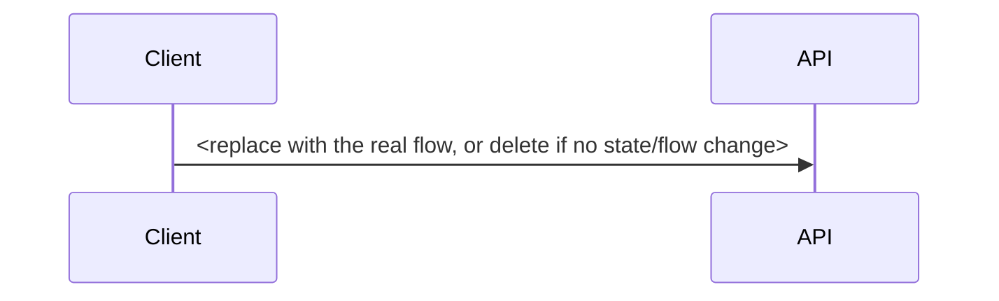

# RFC-0000: <Title>

- **RFC:** 0000 <!-- next number in docs/rfc/ -->
- **Title:** <imperative, concrete — "Adopt X for Y", not "Thoughts on Y">
- **Status:** draft <!-- draft → review → accepted | rejected -->
- **Date:** YYYY-MM-DD
- **Author:** <name>

<!-- Usage: /rfc-new copies this file to NNNN-kebab-case-title.md and fills every
     section. Delete none of them — write "None." rather than removing a heading.
     Lifecycle: update the Status line as the RFC moves draft → review →
     accepted/rejected. Commit as `docs(rfc): propose <title>` and open a PR so the
     review happens in public, even when self-merging. -->

## Problem

<!-- The user/system pain, stated with data or a concrete failure story. Which user
     stories (US-XX) or JD competencies does this touch? Why now — what breaks or
     stays blocked if we do nothing? -->

## Proposal

<!-- The design. Include a Mermaid diagram whenever state or flow changes
     (sequence diagram for flows, stateDiagram-v2 for state machines). -->



## Contracts

<!-- New or changed zod schemas in @irlo/contracts, shown as code. API shapes are
     never hand-written elsewhere — this section is their birthplace. -->

```ts
import { z } from "zod";

export const ExampleSchema = z.object({
  // replace with the real schema
});
export type Example = z.infer<typeof ExampleSchema>;
```

## Test plan

<!-- Named tests per CLAUDE.md §6 (red first), mapped to user stories. -->

| Test | Type | Story |
|---|---|---|
| `server/test/<area>/<name>.test.ts` | unit / integration | US-XX |
| `IrloTests/<Name>Tests.swift` | iOS unit | US-XX |
| `IrloUITests/<Name>UITests.swift` | UI/E2E | US-XX |

## Rollout

- **Flag:** <flag name; how it ships dark and to whom it opens first>
- **Migration:** <schema/data migration steps, or "None.">
- **Revert path:** <exact steps to undo safely — flag off, rollback, down-migration>
- **Success metric / observability:** <the metric that proves success or failure,
  where it is observed (logs/traces/dashboard), and the decision rule>

## Alternatives

<!-- At least two, each with a concrete why-not. "Do nothing" counts as one. -->

1. **<Alternative A>** — why not: <cost/risk/mismatch>
2. **<Alternative B>** — why not: <cost/risk/mismatch>

## Open questions

<!-- Anything unresolved that review should settle. Empty means "None." -->

- None.
